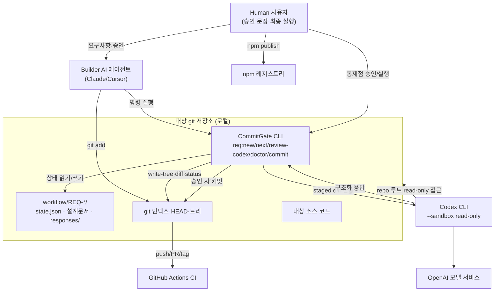

# 01. 시스템 컨텍스트

## 1. 제품 목적과 해결하는 문제

AI 코딩 에이전트는 코드를 빠르게 생성하지만, 리뷰 없이 바로 커밋되면 위험하다. CommitGate는 이 위험을 다음 방식으로 통제한다([README.md](../../README.md)).

- 변경을 **REQ 티켓 단위**로 묶는다.
- **Codex 리뷰가 승인한 staged tree만** 커밋되게 한다.
- 승인 후 코드가 바뀌거나(stale) 증거가 부족하면 **기본적으로 막는다(fail-closed)**.

즉 막는 대상은 단순 명령 실수가 아니라 **"리뷰받지 않은 변경이 커밋되는 상황"**이다.

### 명시적 비보장(설계 경계)
[README.md](../../README.md) "보장하지 않는 것"에 근거한 3대 한계. 재구현 시 방어선을 오산하지 않도록 반드시 유지한다.

1. **하드 강제가 아니다.** git hook을 설치하지 않는다. `req:commit` 대신 `git commit`을 직접 치면 게이트·승인 바인딩·증거 기록이 전부 우회된다. 강제력은 "협조하는 에이전트를 계약 궤도에 유지"하는 데 있다.
2. **staged 비밀을 지켜 주지 않는다.** `req:review-codex`는 리뷰 대상을 Codex(OpenAI)로 전송한다 — **phase 리뷰는 `git diff --cached` 전문**을, **design 리뷰는 git 인덱스의 00/01/02 문서 본문**을 보낸다([scripts/req/review-codex.ts](../../scripts/req/review-codex.ts) `main`). 두 경우 모두 codex는 `--sandbox read-only`로 저장소 루트를 읽으므로 diff/문서에 없는 파일도 읽힐 수 있다. 마스킹·스크러빙·길이 상한이 없다.
3. **커밋 이후를 보장하지 않는다.** 승인은 커밋 시점 staged tree에 대한 것이고, merge·tag·publish는 각각 별도 통제점이다.

## 2. 핵심 사용자와 행위자

| 행위자 | 유형 | 역할 |
|---|---|---|
| **Builder (Claude 등)** | AI 에이전트(내부) | 티켓 생성, 설계·구현, `req:next` 루프 수행, `git add`. |
| **Reviewer (Codex CLI)** | 외부 프로세스 | `req:review-codex`가 조립한 프롬프트를 받아 `machine.schema.json` 형식으로 승인/차단 판정. |
| **Human (사용자)** | 사람 | 통제점에서 승인 문장을 말하고, `req:commit --run`·push·release를 최종 실행/확인. |
| **git** | 로컬 도구 | 모든 게이트의 상태원(HEAD, write-tree, ls-files, status, diff). |
| **패키지 매니저(npm/pnpm/yarn)** | 로컬 도구 | 스크립트 실행·의존성 설치. |
| **OpenAI(Codex 백엔드)** | 외부 서비스 | Codex CLI가 호출하는 모델 서비스. staged diff가 전송되는 곳. |
| **GitHub Actions** | 외부 CI | push/PR/tag 시 매트릭스 검증([10-operations-deployment-and-observability.md](10-operations-deployment-and-observability.md)). |
| **npm 레지스트리** | 외부 | `commitgate` 패키지 배포처(publish 통제점). |

## 3. 시스템 컨텍스트 다이어그램

## 4. 핵심 시나리오(현재 구현 근거)

1. **설치**: `npx commitgate` → 대상 repo에 `scripts/req/*`·스키마·계약파일 복사, `package.json`에 `req:*` 스크립트/devDeps 주입. 파일만 놓고 커밋하지 않는다([bin/init.ts](../../bin/init.ts) `runInit`).
2. **티켓 생성**: `req:new <slug> --run` → clean 워킹트리 요구, `feat/req-*` 브랜치 생성, 티켓 디렉터리+4개 문서+`state.json` 생성 후 스캐폴드 커밋([scripts/req/req-new.ts](../../scripts/req/req-new.ts) `main`).
3. **설계 리뷰**: 00/01/02를 `git add` → `req:review-codex --kind design --run` → Codex가 설계 docs를 리뷰. 승인 시 `design_approved=true`, 설계 해시 바인딩([scripts/req/review-codex.ts](../../scripts/req/review-codex.ts) `applyVerdict`).
4. **구현·phase 리뷰**: phase 구현 → `git add` → `req:doctor` PASS → `req:review-codex --kind phase --phase 
 --run`. 승인은 `findings=[]`일 때만이며 staged tree OID에 바인딩([scripts/req/review-codex.ts](../../scripts/req/review-codex.ts) `validateVerdict` R10).
5. **커밋**: `req:commit --run` → doctor 게이트 → HIGH면 사용자 확인 → 소스 커밋(승인 코드만) → evidence-finalize 커밋([scripts/req/req-commit.ts](../../scripts/req/req-commit.ts) `main`).
6. **다음 행동 계산**: 매 단계 `req:next`가 state+git에서 `RUN/AGENT/AWAIT_HUMAN/DONE/BLOCKED`를 계산(읽기 전용)([scripts/req/req-next.ts](../../scripts/req/req-next.ts) `resolveNext`).

## 5. 비기능 요구사항(NFR) — 현재 구현상 근거

| NFR | 구현 근거 |
|---|---|
| **보안(명령 주입 차단)** | `safeSpawnSync`는 shell 없이 `cross-spawn`으로 실행([scripts/req/lib/adapters.ts](../../scripts/req/lib/adapters.ts)). Windows `.cmd` 래퍼 회귀 테스트([tests/unit/req-adapters-cmd.test.ts](../../tests/unit/req-adapters-cmd.test.ts)). |
| **무결성(승인 위조 방지)** | 승인 응답 sha256을 `approvals.jsonl`·`state.json`에 고정, 재검증([scripts/req/req-doctor.ts](../../scripts/req/req-doctor.ts) `evidenceProblems`). |
| **결정성/재현성** | `req:next`·상태 머신은 state+git의 순수 함수. `git status -z` 파싱 고정([scripts/req/lib/porcelain.ts](../../scripts/req/lib/porcelain.ts)). |
| **이식성(크로스 플랫폼)** | CI가 `{ubuntu,macos,windows} × {Node 18,20,22}` 9-leg([.github/workflows/ci.yml](../../.github/workflows/ci.yml)). BOM·경로·shell 연산자 회피([bin/init.ts](../../bin/init.ts)). |
| **관측성** | 텔레메트리 없음. 신호는 exit code + stderr 텍스트([10-operations-deployment-and-observability.md](10-operations-deployment-and-observability.md)). |
| **비용 통제(리뷰 토큰)** | 리뷰 모델·추론강도를 `-c`로 고정(기본 `gpt-5.6-terra`/`high`)해 전역 설정 상속으로 인한 토큰 과다를 방지([scripts/req/lib/config.ts](../../scripts/req/lib/config.ts) `DEFAULTS`). |

성능 SLA·처리량 목표는 저장소에 명시되어 있지 않다 — `확인 불가`. 실질 성능 요인은 Codex 리뷰 왕복 시간(모델·추론강도 의존)이다.
