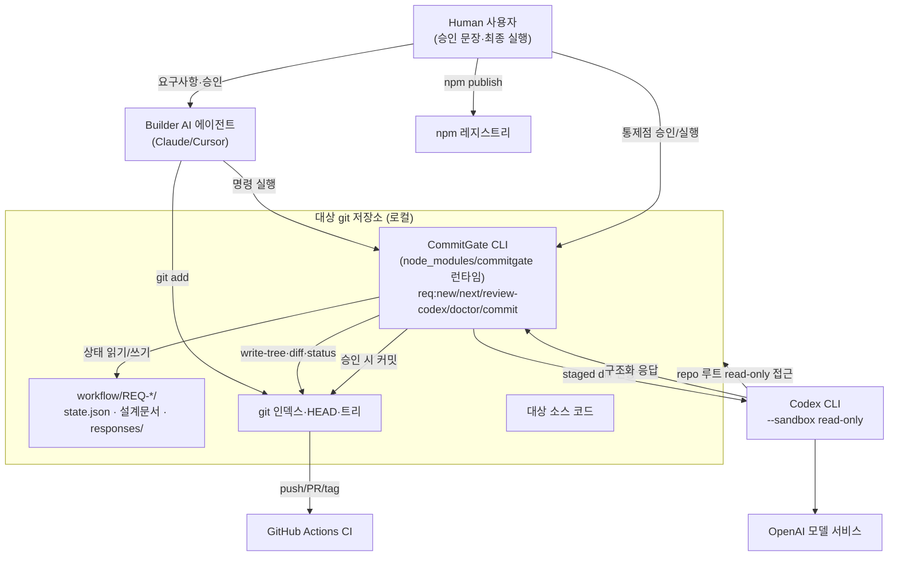

# 01. 시스템 컨텍스트

## 1. 제품 목적과 해결하는 문제

AI 코딩 에이전트는 코드를 빠르게 생성하지만, 리뷰 없이 바로 커밋되면 위험하다. CommitGate는 이 위험을 다음 방식으로 통제한다([README.md](../../README.md)).

- 변경을 **REQ 티켓 단위**로 묶는다.
- **Codex 리뷰가 승인한 staged tree만** 커밋되게 한다.
- 승인 후 코드가 바뀌거나(stale) 증거가 부족하면 **기본적으로 막는다(fail-closed)**.

즉 막는 대상은 단순 명령 실수가 아니라 **"리뷰받지 않은 변경이 커밋되는 상황"**이다.

### 1.1 미션과 제품 가치

CommitGate의 미션은 **AI가 만든 변경을 사람이 통제 가능한 증거 단위로 변환하는 것**이다. 이 제품은 코드 생성 품질 자체를 높이는 모델이 아니라, 생성 이후의 의사결정과 변경 무결성을 다루는 거버넌스 계층이다.

| 사용자 문제 | CommitGate가 만드는 가치 | 현재 구현 증거 |
|---|---|---|
| Builder가 자기 변경을 곧바로 커밋 | 역할이 분리된 Codex Reviewer 판정을 요구 | `review-codex` + persona + 구조화 응답 |
| “리뷰했다”는 말과 실제 커밋 대상이 다를 수 있음 | 승인을 staged tree OID/design hash에 바인딩 | `approved_diff_hash`, `design_approved_hash` |
| 승인 뒤 작은 수정으로 검토 범위가 바뀜 | stale 승인을 거부하고 재리뷰 요구 | doctor D9 + `req:commit` tree 재검사 |
| 승인 근거가 대화에만 남아 추적 불가 | 응답·sha256·소비 커밋을 감사 체인으로 보존 | archive + `approvals.jsonl` |
| 에이전트가 다음 단계를 임의 추측 | state+git에서 다음 행동을 결정적으로 계산 | `req:next` |

이 가치의 핵심 차별점은 “리뷰를 호출한다”가 아니라 **리뷰 대상과 커밋 대상이 동일하다는 것을 기계적으로 증명한다**는 점이다.

### 1.2 목표 사용자와 핵심 작업

- **1차 사용자**: AI 코딩 에이전트를 일상적으로 쓰는 1인 개발자. 사람의 반복 확인 부담을 줄이되 최종 통제권을 잃지 않으려는 사용자.
- **2차 사용자**: AI 변경의 승인 근거와 재현 가능한 감사 이력이 필요한 소규모 팀.
- **확장 사용자**: 외부 전송 정책·CI 강제·복구성을 요구하는 보안 민감 팀. 이 사용자에게 필요한 일부 기능은 아직 미구현이다([14-product-strategy-and-roadmap.md](14-product-strategy-and-roadmap.md) STR-01~04).

핵심 Job-to-be-Done은 다음 한 문장으로 요약된다.

> “AI가 만든 변경을 빠르게 활용하되, 정확히 그 변경만 독립적으로 승인받고, 문제가 생기면 누가 무엇을 근거로 통과시켰는지 재현하고 싶다.”

### 1.3 제품 원칙

1. **정확한 아티팩트가 설명보다 우선한다.** 승인 문자열보다 git OID·sha256을 신뢰한다.
2. **불확실하면 차단한다.** 응답 부재·스키마 오류·stale·증거 불일치는 승인으로 완화하지 않는다.
3. **차단과 개선 제안을 분리한다.** P1만 `findings`, 나머지는 `observations`로 보내 리뷰가 유한하게 수렴해야 한다.
4. **사람의 승인은 통제점별로 분리한다.** commit·integration·release 승인을 서로 이월하지 않는다.
5. **현재 보장 경계를 숨기지 않는다.** 로컬 CLI·단일 active worktree·협조적 작업자 모델을 절대적 보안 시스템처럼 표현하지 않는다.
6. **외부 전송을 명시한다.** Reviewer 호출은 코드 처리 기능인 동시에 데이터 경계다.

### 1.4 가치가 성립하지 않는 실패 조건

다음 중 하나가 발생하면 명령이 성공했더라도 제품 목적은 달성되지 않은 것이다.

- 승인된 tree와 다른 tree가 커밋된다.
- 증거가 변조·재사용되거나 source commit과 연결되지 않는다.
- 비차단 의견이 계속 차단 채널로 들어가 리뷰가 무한 반복된다.
- 사용자가 인지하지 못한 코드·문서가 외부 Reviewer로 전송된다.
- scratch 상태가 사라졌을 때 기존 증거로 진행 상태를 복구하지 못한다.
- 로컬 게이트를 우회한 커밋이 protected branch에서 탐지되지 않는다.

앞의 두 항목은 현재 구현이 강하게 방어한다. 뒤의 네 항목은 부분 방어 또는 미구현이며 [gaps-and-decisions.md](gaps-and-decisions.md)와 [14](14-product-strategy-and-roadmap.md)의 최우선 개선 대상이다.

### 명시적 비보장(설계 경계)
[README.md](../../README.md) "보장하지 않는 것"의 3대 한계와 코드 분석에서 확인한 운영 한계다. 재구현 시 방어선을 오산하지 않도록 반드시 유지한다.

1. **하드 강제가 아니다.** git hook을 설치하지 않는다. `req:commit` 대신 `git commit`을 직접 치면 게이트·승인 바인딩·증거 기록이 전부 우회된다. 강제력은 "협조하는 에이전트를 계약 궤도에 유지"하는 데 있다.
2. **staged 비밀을 지켜 주지 않는다.** `req:review-codex`는 리뷰 대상을 Codex(OpenAI)로 전송한다 — **phase 리뷰는 `git diff --cached` 전문**을, **design 리뷰는 git 인덱스의 00/01/02 문서 본문**을 보낸다([scripts/req/review-codex.ts](../../scripts/req/review-codex.ts) `main`). 두 경우 모두 codex는 `--sandbox read-only`로 저장소 루트를 읽으므로 diff/문서에 없는 파일도 읽힐 수 있다. 마스킹·스크러빙·길이 상한이 없다.
3. **커밋 이후를 보장하지 않는다.** 승인은 커밋 시점 staged tree에 대한 것이고, merge·tag·publish는 각각 별도 통제점이다.
4. **진행 상태의 자동 내구 복구를 보장하지 않는다.** `state.json`의 런타임 변경은 scratch이며 정상 `req:commit`이 커밋하지 않는다. 수동 최종 상태 커밋 사례는 있으나 제품 명령 계약이 아니므로 fresh clone에서 동일 진행 판정을 자동 복원한다고 약속할 수 없다([03-domain-and-data-model.md](03-domain-and-data-model.md) §8, [gaps-and-decisions.md](gaps-and-decisions.md) G-09).
5. **리뷰가 유한 시간·횟수 안에 끝난다고 보장하지 않는다.** codex timeout과 NEEDS_FIX 라운드 상한·escalation이 없다(G-01, G-06a).

## 2. 핵심 사용자와 행위자

| 행위자 | 유형 | 역할 |
|---|---|---|
| **Builder (Claude 등)** | AI 에이전트(내부) | 티켓 생성, 설계·구현, `req:next` 루프 수행, `git add`. |
| **Reviewer (Codex CLI)** | 외부 프로세스 | `req:review-codex`가 조립한 프롬프트를 받아 `machine.schema.json` 형식으로 승인/차단 판정. |
| **Human (사용자)** | 사람 | 통제점에서 승인 문장을 말하고, `req:commit --run`·push·release를 최종 실행/확인. |
| **git** | 로컬 도구 | 모든 게이트의 상태원(HEAD, write-tree, ls-files, status, diff). |
| **패키지 매니저(npm/pnpm/yarn)** | 로컬 도구 | 스크립트 실행·의존성 설치. |
| **OpenAI(Codex 백엔드)** | 외부 서비스 | Codex CLI가 호출하는 모델 서비스. staged diff가 전송되는 곳. |
| **GitHub Actions** | 외부 CI | push/PR/tag 시 매트릭스 검증([10-operations-deployment-and-observability.md](10-operations-deployment-and-observability.md)). |
| **npm 레지스트리** | 외부 | `commitgate` 패키지 배포처(publish 통제점). |

## 3. 시스템 컨텍스트 다이어그램

## 4. 핵심 시나리오(현재 구현 근거)

1. **설치**: **2단계다** — `npm install -D commitgate`로 런타임 패키지를 devDependency로 설치한 뒤 `npx commitgate init`. init은 **관리 자산만 배치한다**(스키마 2종·`review-persona.md`, `req.config.json` 시드, `AGENTS.md`·에이전트 진입점). **실행 코드는 복사하지 않는다** — `scripts/req/**`는 `node_modules/commitgate` 안에만 있고, 대상 `package.json`에는 `req:* = commitgate <verb>`만 주입돼 그 런타임으로 dispatch된다(기존 키는 덮지 않음). `tsx`·`ajv`·`cross-spawn`도 **주입하지 않는다** — `commitgate` 패키지의 runtime `dependencies`라 전이 설치된다. 파일만 놓고 커밋하지 않는다([bin/init.ts](../../bin/init.ts) `planInstall`·`STAGE_B_REQ_SCRIPTS`). 기존 Stage A(vendored scaffold) 설치본이면 init이 쓰기 전에 **fail-closed로 막고** `commitgate migrate`로 보낸다([bin/init.ts](../../bin/init.ts) `detectStageA`, [bin/migrate.ts](../../bin/migrate.ts)).
2. **티켓 생성**: `req:new <slug> --run` → clean 워킹트리 요구, `feat/req-*` 브랜치 생성, 티켓 디렉터리+4개 문서+`state.json` 생성 후 스캐폴드 커밋([scripts/req/req-new.ts](../../scripts/req/req-new.ts) `main`).
3. **설계 리뷰**: 00/01/02를 `git add` → `req:review-codex --kind design --run` → Codex가 설계 docs를 리뷰. 승인 시 `design_approved=true`, 설계 해시 바인딩([scripts/req/review-codex.ts](../../scripts/req/review-codex.ts) `applyVerdict`).
4. **구현·phase 리뷰**: phase 구현 → `git add` → `req:doctor` PASS → `req:review-codex --kind phase --phase 
 --run`. 승인은 `findings=[]`일 때만이며 staged tree OID에 바인딩([scripts/req/review-codex.ts](../../scripts/req/review-codex.ts) `validateVerdict` R10).
5. **커밋**: `req:commit --run` → doctor 게이트 → HIGH면 사용자 확인 → 소스 커밋(승인 코드만) → evidence-finalize 커밋([scripts/req/req-commit.ts](../../scripts/req/req-commit.ts) `main`).
6. **다음 행동 계산**: 매 단계 `req:next`가 state+git에서 `RUN/AGENT/AWAIT_HUMAN/DONE/BLOCKED`를 계산(읽기 전용)([scripts/req/req-next.ts](../../scripts/req/req-next.ts) `resolveNext`).

## 5. 비기능 요구사항(NFR) — 현재 구현상 근거

| NFR | 구현 근거 |
|---|---|
| **보안(명령 주입 차단)** | `safeSpawnSync`는 shell 없이 `cross-spawn`으로 실행([scripts/req/lib/adapters.ts](../../scripts/req/lib/adapters.ts)). Windows `.cmd` 래퍼 회귀 테스트([tests/unit/req-adapters-cmd.test.ts](../../tests/unit/req-adapters-cmd.test.ts)). |
| **무결성(승인 위조 방지)** | 승인 응답 sha256을 `approvals.jsonl`·`state.json`에 고정, 재검증([scripts/req/req-doctor.ts](../../scripts/req/req-doctor.ts) `evidenceProblems`). |
| **결정성/재현성** | `req:next`·상태 머신은 state+git의 순수 함수. `git status -z` 파싱 고정([scripts/req/lib/porcelain.ts](../../scripts/req/lib/porcelain.ts)). |
| **이식성(크로스 플랫폼)** | CI가 `{ubuntu,macos,windows} × {Node 18,20,22}` 9-leg([.github/workflows/ci.yml](../../.github/workflows/ci.yml)). BOM·경로·shell 연산자 회피([bin/init.ts](../../bin/init.ts)). |
| **관측성** | 텔레메트리 없음. 신호는 exit code + stderr 텍스트([10-operations-deployment-and-observability.md](10-operations-deployment-and-observability.md)). |
| **비용 통제(리뷰 토큰)** | 리뷰 모델·추론강도를 `-c`로 고정(기본 `gpt-5.6-terra`/`high`)해 전역 설정 상속으로 인한 토큰 과다를 방지([scripts/req/lib/config.ts](../../scripts/req/lib/config.ts) `DEFAULTS`). |
| **복구성** | evidence-finalize 중단은 `pending_evidence_for` + `req:commit --finalize`로 복구. 단 scratch `state.json` 전체를 fresh clone에서 재구축하는 기능은 없음. |
| **수렴성** | BLOCKED 2회 회로차단과 stateless 재리뷰가 있으나 NEEDS_FIX 절대 상한은 없음. |

성능 SLA·처리량 목표는 저장소에 명시되어 있지 않다 — `확인 불가`. 실질 성능 요인은 Codex 리뷰 왕복 시간(모델·추론강도 의존)이다.

## 6. 제품 성과 기준의 현재 공백

현재 저장소는 기능 정확성 테스트는 풍부하지만 온보딩 시간, 리뷰 라운드 P50/P95, 승인까지의 대기 시간, fresh-clone 복구율, CI 증거 검증률을 집계하지 않는다. 따라서 “사용자에게 얼마나 획기적인가”를 릴리즈 버전이나 테스트 개수만으로 판단할 수 없다. 목표 지표와 수집 원칙은 [14-product-strategy-and-roadmap.md](14-product-strategy-and-roadmap.md) §4에 정의하며, 구현 전까지는 `확인 불가`다.
