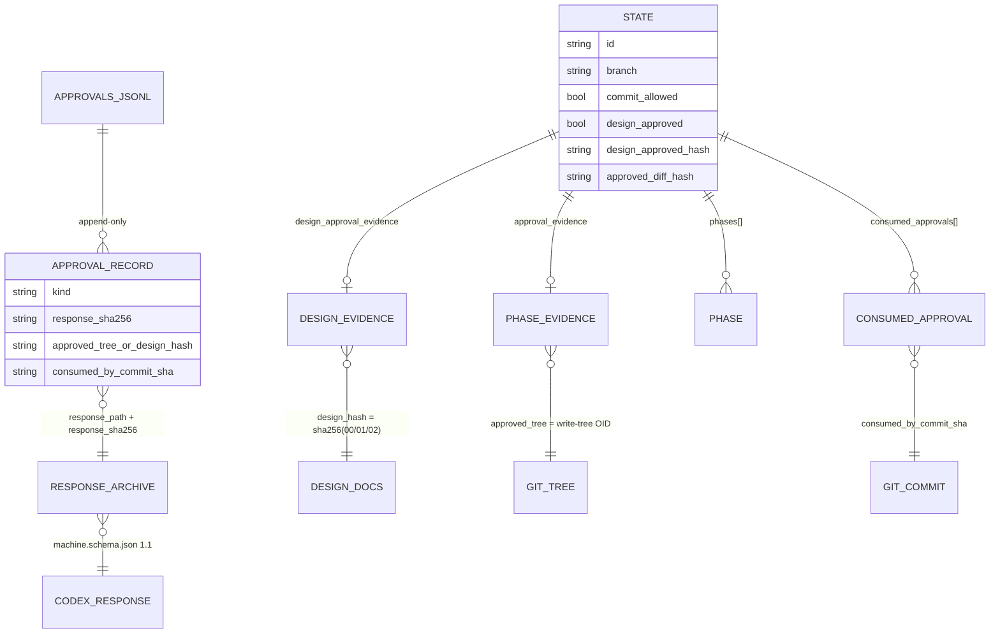

# 03. 도메인·데이터 모델

CommitGate의 "데이터"는 DB가 아니라 **git 저장소 안의 파일**이다. 영속 데이터는 티켓 디렉터리(`workflow/REQ-*/`)의 JSON/JSONL/Markdown이며, 진실의 최종 원천은 **git 자체**(HEAD·트리 OID·인덱스)다. 이 문서가 이후 모든 문서의 어휘 기반이다.

## 1. 엔터티 개요

| 엔터티 | 저장 위치 | 소유자(쓰기 주체) | 생명주기 |
|---|---|---|---|
| **티켓 상태** `state.json` | `workflow/REQ-*/state.json` | `req:new`(생성), `review-codex`/`req:commit`(변경) | 생성 시 스캐폴드 커밋에 포함되어 **tracked**. 이후 변경은 scratch로 취급되어 source/evidence 커밋에 포함되지 않음(§8). |
| **설계 문서** 00/01/02 | `workflow/REQ-*/` | Builder(사람/AI) | git 추적. 설계 승인의 바인딩 대상. |
| **리뷰 요청** `codex-request.md` | `workflow/REQ-*/` | Builder | git 추적. 리뷰 프롬프트 본문. |
| **Codex 응답(스크래치)** `codex-response.json` | `workflow/REQ-*/` | `review-codex`(codex stdout) | scratch. gitignore. |
| **리뷰 프리뷰** `.review-preview.txt` | `workflow/REQ-*/` | `review-codex` | scratch. gitignore. |
| **응답 아카이브** `responses/<base>-rNN-<outcome>.json` | `workflow/REQ-*/responses/` | `review-codex` | git 추적(증거). |
| **증거 원장** `approvals.jsonl` | `workflow/REQ-*/responses/` | `req:commit` | git 추적(append-only 감사). |
| **설정** `req.config.json` | repo 루트 | 사람/설치기 | git 추적(선택). |

## 2. `state.json` — 티켓 상태(전체 필드)

BOM 없는 UTF-8, 2-space 들여쓰기([scripts/req/review-codex.ts](../../scripts/req/review-codex.ts) `writeState`). 필드는 진행에 따라 추가**되기도 하고 제거되기도** 한다 — 예: `processResponse`는 같은 kind의 stale 증거를 제거하고, `consumeState`는 `approval_evidence`·`pending_evidence_for`를 제거하며, `clearBlockedReview`는 `blocked_review`를 제거한다. 초기 상태는 `req:new`의 `buildInitialState`([scripts/req/req-new.ts](../../scripts/req/req-new.ts))가, 이후 변경은 `applyVerdict`/`processResponse`/`consumeState`가 수행한다.

### 2.1 초기(INTAKE) 필드

| 필드 | 타입 | 의미 | 초기값 |
|---|---|---|---|
| `id` | string | 티켓 id `REQ-YYYY-NNN` | `REQ-2026-NNN`(예시 형식) |
| `branch` | string | 작업 브랜치명 | `feat/req-...` |
| `phase` | string | 코스 수명주기 단계 | `"INTAKE"` |
| `risk_level` | `"LOW"`\|`"HIGH"` | 영향도(HIGH면 커밋 전 사용자 확인 필요) | `"LOW"` |
| `codex_thread_id` | string\|null | Codex 스레드 UUID | `null` |
| `review_base_sha` | string\|null | 리뷰 기준 커밋 SHA | `null` |
| `review_diff_hash` | string\|null | 현재 리뷰 중 staged 트리/diff 해시 | `null` |
| `approved_diff_hash` | string\|null | 마지막 승인 diff(=staged tree OID) | `null` |
| `commit_allowed` | boolean | 지금 커밋 허용 여부(게이트 플래그) | `false` |
| `design_approved` | boolean | 설계 리뷰 통과 여부 | `false` |
| `design_approved_hash` | string\|null | 승인된 설계(00/01/02) sha256 바인딩 | `null` |
| `current_phase` | string\|null | 활성 phase id | `null` |
| `phases` | array | phase 레코드 `{id, approved}` | `[]` |
| `approval_evidence_required` | boolean | 증거 로그 강제 여부(신규=true) | `true` |

> `approval_evidence_required`는 **grandfathering 트리거**다: 신규 REQ는 `true`(증거 없으면 FAIL), 필드가 아예 없는 레거시 티켓은 WARN으로 완화([scripts/req/req-doctor.ts](../../scripts/req/req-doctor.ts) D16/D17).

### 2.2 진행 중 추가되는 필드

| 필드 | 타입 | 의미 | 기록 주체 |
|---|---|---|---|
| `last_review` | object | 최근 리뷰 스냅샷(자문용, 게이트 아님) | `review-codex` `recordLastReview` |
| `design_approval_evidence` | object | 설계 승인 증거 핀 | `review-codex` `processResponse` |
| `approval_evidence` | object | phase 승인 증거 핀 | `review-codex` `processResponse` |
| `user_commit_confirmed` | null\|object | HIGH 커밋 사람 확인 레코드 | 사람이 수기 기록 |
| `consumed_approvals` | array | 소비된 승인 원장(anti-replay) | `req:commit` `consumeState` |
| `blocked_review` | object | blocked 회로차단 마커 | `review-codex` `recordBlockedReview` |
| `pending_evidence_for` | object | evidence-finalize 복구 마커 | `req:commit` `markPendingEvidence` |

- **`last_review`**: `{review_kind, phase_id, outcome, compare_hash, count, errors[], at, findings[]?, elided_count?}`. `errors`는 `invalid`일 때만, `findings` 스냅샷은 `needs-fix`일 때만 저장. 상한: 최대 10 findings, detail 300B, 총 4096B([scripts/req/review-codex.ts](../../scripts/req/review-codex.ts) `SNAPSHOT_MAX_*`).
- **`design_approval_evidence`**: `{response_path, response_sha256, review_kind, phase_id(=null), review_base_sha, codex_thread_id, machine_schema_version, status, commit_approved, approved_at, design_hash}`.
- **`consumed_approvals[]`**: `{approved_tree, phase_id, consumed_by_commit_sha, approval_consumed_at}`. **하나의 승인 트리는 정확히 한 커밋만 소비**(anti-replay). `req:next`의 phase 진행 판정 SSOT([scripts/req/req-next.ts](../../scripts/req/req-next.ts) `nextPhaseId`).
- **`user_commit_confirmed`**: 유효하려면 `{confirmed:true, method:비공백, confirmed_at:ISO}`([scripts/req/req-commit.ts](../../scripts/req/req-commit.ts) `userConfirmProblem`). 어떤 CLI도 자동 기록하지 않는다 — **사람이 직접 기록**해야 HIGH 커밋 통과.

## 3. `req.config.json` 스키마([workflow/req.config.schema.json](../../workflow/req.config.schema.json))

루트 object, `additionalProperties:false`, `required` 없음(모두 선택, 기본값은 코드의 `DEFAULTS`).

| 키 | 타입 | 제약 | 기본값(DEFAULTS) |
|---|---|---|---|
| `ticketRoot` | string | `minLength:1`, 루트 내부 | `"workflow"` |
| `schemaPath` | string | `minLength:1`, 루트 내부 | `"workflow/machine.schema.json"` |
| `handoffPath` | string\|null | confinement 예외 | `null` |
| `reviewPersonaPath` | string\|null | `minLength:1`, 루트 내부 | `"workflow/review-persona.md"` |
| `branchPrefix` | string | `minLength:1`(빈 값=D11 무력화, 금지) | `"feat/req-"` |
| `packageManager` | string | enum `pnpm\|npm\|yarn` | `pnpm`(런타임 `DEFAULTS`). 설치기가 lockfile로 감지해 주입 |
| `granularityMaxFiles` | integer | `minimum:1` | `8` |
| `reviewModel` | string\|null | pattern `^[A-Za-z0-9][A-Za-z0-9._-]*$`(TOML 주입 차단) | `"gpt-5.6-terra"` |
| `reviewReasoningEffort` | string\|null | enum `none\|minimal\|low\|medium\|high\|xhigh\|null` | `"high"` |
| `designDocs.{requirement,design,plan}` | string | pattern(경로순회 차단) | `00-/01-/02-*.md` |

> 모델/추론강도 고정은 `DEFAULTS` 중립성의 **의도적 예외**다([scripts/req/lib/config.ts](../../scripts/req/lib/config.ts) 주석): 리뷰 모델은 게이트 무결성에 직결되므로 전역(`~/.codex/config.toml`) 상속이 아니라 고정한다.

## 4. Codex 응답 스키마([workflow/machine.schema.json](../../workflow/machine.schema.json))

리뷰어가 **반드시** 반환해야 하는 JSON 형식. 루트 object, `additionalProperties:false`. 필수 9필드 + 선택 `observations`.

| 필드 | 타입 | enum/제약 | 필수 |
|---|---|---|---|
| `machine_schema_version` | string | `["1.1"]` (유일값) | ✅ |
| `review_base_sha` | string | — | ✅ |
| `status` | string | `NEEDS_FIX`\|`STEP_COMPLETE`\|`COMPLETE` | ✅ |
| `commit_approved` | string | `yes`\|`no` | ✅ |
| `merge_ready` | string | `yes`\|`no` | ✅ |
| `risk_level` | string | `LOW`\|`HIGH` | ✅ |
| `review_kind` | string | `design`\|`phase` | ✅ |
| `findings` | array | `{severity:P1\|P2\|P3, detail:string, file:string\|null}` | ✅ |
| `next_action` | string | — | ✅ |
| `observations` | array | `{detail:string, file:string\|null}` — **severity 없음** | ❌(선택) |

### 4.1 승인/차단 의미론(가장 중요한 불변식)
게이트는 `findings`와 `commit_approved`의 **관계**에서 파생되며 fail-closed로 강제된다.

- **승인(APPROVE)** = `commit_approved="yes"` **AND** `findings=[]`. 지적이 하나라도 있는데 `yes`면 **모순 → 거부**(R10, [scripts/req/review-codex.ts](../../scripts/req/review-codex.ts) `validateVerdict`).
- **NEEDS_FIX** = `commit_approved="no"` + 비어있지 않은 `findings`(각 finding이 차단 사유).
- **BLOCKED** = `commit_approved="no"` + `findings=[]`(모순/거부). "지적이 없으면 반드시 승인해야 한다." `observations`만으로는 이 상태를 구제하지 못한다.
- `observations`에 `severity`를 붙이는 순간 차단 신호가 되어 경계가 무너지므로, 스키마가 아예 필드를 금지한다.

`commit_approved="yes"`의 kind별 의미:
- `design`: 설계 진행 승인이며 **아무 것도 커밋되지 않는다**. 좋은 설계는 `commit_approved="yes"` + `merge_ready="no"`.
- `phase`: staged 트리를 커밋해도 좋다는 승인.

`merge_ready="yes"`는 오직 `status="COMPLETE"`이고 `commit_approved="yes"`일 때만 유효(교차 검사).

## 5. 응답 아카이브·증거 원장

### 5.1 `responses/<base>-rNN-<outcome>.json`
- `base` = `design` 또는 phase id(예: `phase-2-init-cli`).
- `rNN` = 라운드(≥2자리, `nextArchiveRound` = 기존 max+1).
- `outcome` = `approved`\|`needs-fix`. 내용 = `machine.schema.json` 페이로드 1줄.
- 명명 정규식 `^[A-Za-z0-9][A-Za-z0-9-]*-r\d{2,}-(approved|needs-fix)\.json$`([scripts/req/lib/scratch.ts](../../scripts/req/lib/scratch.ts) `ARCHIVE_NAME_RE`).

### 5.2 `approvals.jsonl` (append-only 감사 원장)
한 줄당 JSON 1개. 각 레코드가 저장된 Codex 승인 응답과 그것을 소비한 커밋을 바인딩한다.

공통 필드: `kind`, `phase_id`(design은 null), `response_path`, `response_sha256`(변조 방지 바인딩), `review_base_sha`, `approved_at`, `consumed_at`, `consumed_by_commit_sha`, `user_commit_confirmed`.
- **design** 레코드: `design_hash` 포함(`approved_tree` 없음).
- **phase** 레코드: `approved_tree`(git 트리 해시) 포함(`design_hash` 없음).

무결성은 `req:commit`의 `validateManifest`가 재검증한다: 필드 화이트리스트(주입 차단), 경로 confinement(`..` 금지), basename이 `<base>-rNN-approved.json`인지, OID/ISO/64hex 형식, 중복 탐지([scripts/req/req-commit.ts](../../scripts/req/req-commit.ts)).

## 6. 설계 문서 00/01/02 구조

파일명은 `req.config.json`의 `designDocs`에 대응. 티켓당 3종이 설계 승인의 바인딩 대상([scripts/req/review-codex.ts](../../scripts/req/review-codex.ts) `captureDesignBinding` — 정확히 3개 tracked 항목이 아니면 fail-closed).

> **주의(도구가 강제하는 것 vs 관례)**: 도구가 강제하는 것은 (a) 3개 파일이 tracked로 존재해야 함, (b) 그 내용 해시가 설계 승인 바인딩이 됨뿐이다. `req:new`은 `00`에 **제목 + 요구사항 본문**을, `01`·`02`에 **스캐폴드 골격**만 생성하며 아래 헤더 구조를 검증하지 않는다([scripts/req/req-new.ts](../../scripts/req/req-new.ts) `main`). 아래는 기존 티켓들에서 관찰되는 **작성 관례**이지 도구 강제 스키마가 아니다.

- **`00-requirement.md`**(관례): `## 배경 / ## 목표 / ## 범위(In·Out) / ## 수용 기준`.
- **`01-design.md`**(관례): 요약 → `## 현재 상태` → `## 핵심 설계 결정`(D1…Dn 안정 ID) → `## Phase별 구현` → `## 변경 파일` → `## 하위호환·안전`.
- **`02-plan.md`**(관례): granularity 주석(≤8 파일/phase 권고, D18 WARN) → `## Phase N — <name> (<phase-id>)`(범위 + Exit 기준) → `## 완료`.

## 7. ERD — 승인 바인딩 체인

**바인딩 요약**: phase 승인 = staged 트리 OID(`git write-tree`), design 승인 = `git ls-files -s -- 00/01/02`의 정렬 sha256. 응답 sha256 → `approvals.jsonl`/`state.json` 고정 → git 트리/설계 해시에 바인딩 → 정확히 하나의 커밋이 소비. 내용이 바뀌면 해시가 달라져 승인이 무효화(stale)된다([07-business-rules-and-state-machines.md](07-business-rules-and-state-machines.md) §2).

## 8. 삭제·보존 규칙
- `state.json`은 티켓 생성 시 스캐폴드 커밋에 포함되어 **tracked**이지만, 이후 변경(`review-codex`/`req:commit`의 `writeState`)은 clean-tree에서 **scratch로 무시**되며 source/evidence 커밋에 스테이징되면 `req:commit`이 차단한다.
- `codex-response.json`·`.review-preview.txt`는 gitignore되어 **아예 커밋되지 않는다**(순수 scratch).
- 아카이브·`approvals.jsonl`은 **감사 증거로 영구 보존**. `req:commit`은 append만, 삭제 없음.
- 제거 시에도 티켓 증거 디렉터리는 자동 삭제 대상에서 제외([bin/uninstall.ts](../../bin/uninstall.ts) `protect`).
