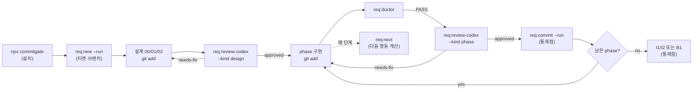

# 05. 사용자 흐름·UI(CLI) 명세

CommitGate에는 웹/그래픽 UI가 없다(`해당 없음`). 유일한 인터페이스는 **로컬 CLI**다. 이 문서는 각 명령을 "화면"으로 보아 진입 조건·입력·표시(출력)·상태·전이·오류·접근 제어를 명세한다. 인자 계약의 정밀 명세는 [06-api-and-integration-contracts.md](06-api-and-integration-contracts.md)와 중복하지 않도록 여기서는 흐름 중심으로 기술한다.

## 1. 전체 여정 개요

핵심 원리: **다음 행동을 추측하지 않는다.** `req:next`가 state+git에서 계산해 준다. `RUN`이면 출력 명령을 그대로 실행, `AGENT`면 그 작업 후 `git add`, `AWAIT_HUMAN`이면 멈춰 승인 문장을 받는다([scripts/req/req-next.ts](../../scripts/req/req-next.ts)).

> 다이어그램의 `DESIGN_REVIEW`·`PHASE_IMPL`·`DONE`은 **사용자 여정을 설명하는 논리 상태**다. 현재 CLI가 `state.json.phase`를 이 값들로 갱신하지 않는다. 실제 분기는 여러 state 필드와 git 상태에서 파생된다([03](03-domain-and-data-model.md) §2, [07](07-business-rules-and-state-machines.md) §4).

## 2. 화면 A — 설치 `npx commitgate`

- **진입 조건**: 대상 폴더가 git repo이고 `package.json` 존재. 아니면 fail-closed throw([bin/init.ts](../../bin/init.ts) `assertGitWorkTree`).
- **입력(플래그)**: `--dir <path>`(기본 cwd), `--force`, `--dry-run`, `--strict`, `--no-agent-entrypoints`, `-h/--help`. 알 수 없는 인자 → throw.
- **표시(stdout)**: `commitgate 설치: <root>` → packageManager 감지 → `복사 N개/스킵 M개`(`+`/`=` 목록) → `req.config.json`/`package.json`/`AGENTS.md`/`CLAUDE.md`/`workflow/.gitignore` 처리 결과 → gitignore 제외 산출물 → 설치 전 워킹트리 분류 → (경고) → `다음:` 안내.
- **상태 전이**: 파일 미존재 시에만 복사(기존 보존). `--force`는 kit 파일 덮어쓰되 사용자 `CLAUDE.md`/`AGENTS.md`/`workflow/.gitignore`는 보존.
- **오류/경고**: cross-spawn 하한 미달(WARN, `--strict`면 throw), 계약 포인터 gitignore(WARN/throw), 워킹트리에 안전 커밋 불가(`--strict`면 throw). **파일을 하나도 쓰기 전에** 프리플라이트에서 중단.
- **접근 제어**: 없음(로컬).
- **`--dry-run`**: 계획만 출력, **쓰기 0**(스냅샷 불변).

## 3. 화면 B — 티켓 생성 `req:new <slug> --run`

- **진입 조건**: **clean 워킹트리**(도구 산출물 scratch 제외). 미충족 시 throw `워킹트리가 clean이어야 req:new --run 가능`([scripts/req/req-new.ts](../../scripts/req/req-new.ts) `findReqNewDirtyEntries`).
- **입력**: 위치 인자 `slug`(kebab-case 필수), `--run`, `--risk LOW|HIGH`, `--title <v>`, `--root <v>`. `--run` 없으면 dry-run(부작용 0).
- **표시/전이(--run)**: 현재 브랜치≠`main`이면 WARN → `git checkout -b <branch>` → 티켓 디렉터리 생성 → `state.json`(BOM 없음) + 00/01/02 + `codex-request.md` 작성 → `git add <ticketRel>` → `git commit -m "chore(req): <reqId> 티켓 생성"` → 다음 단계 힌트.
- **채번**: `workflow/REQ-*` 스캔 max+1(레지스트리 없음).
- **오류**: slug 누락/비-kebab, `--risk` 오타, `--root` 값 누락 → 각기 throw(fail-closed).
- **접근 제어**: 없음.

## 4. 화면 C — 리뷰 `req:review-codex <id> --kind <design|phase> [--phase 
] --run`

- **진입 조건**: 티켓 `state.json`·`codex-request.md` 존재. 리뷰어 페르소나 파일 유효(null이면 비활성, 부재/빈/심볼릭링크 이탈 → fail-closed).
- **입력**: `--kind design|phase`(기본 phase), `--phase <id>`, `--run`(실호출)/`--dry-run`(프리뷰), `--fresh-thread`(blocked 회복), `--handoff`, `--root`.
- **선행 게이트(라이브)**:
  1. 리뷰 전 clean-tree(`findUnstagedOrUntracked`) 비어야 함 — 아니면 throw(`preDirty`).
  2. phase이고 `phaseId`가 있으면 `designValid`(설계 승인+해시 일치) 아니면 throw.
  3. 같은 대상 blocked가 2회 누적이면 codex 호출 없이 `process.exit(2)`(회로차단).
- **표시(--run)**: "codex 실제 호출" 경고 → codex 응답을 `codex-response.json`에 기록 → AJV+도메인 검증 → verdict 적용 → 아카이브(`responses/<base>-rNN-<outcome>.json`) → outcome 출력(findings/next_action/observations).
- **사후 무변경 검사**: 호출 후 워킹트리가 여전히 clean해야 하고 `git write-tree`가 리뷰 시점 트리와 동일해야 함(리뷰어가 인덱스/워킹트리 수정 시 throw).
- **exit code**: `approved:0`, `invalid:1`, `blocked:2`, `needs-fix:3`([scripts/req/review-codex.ts](../../scripts/req/review-codex.ts) `REVIEW_EXIT_CODES`).
- **dry-run**: 프리뷰 정보(review_base_sha, review_tree, design_hash 등) 출력 후 종료(codex 미호출).
- **외부 전송 경고**: `--run`은 리뷰 대상을 Codex로 보낸다 — **phase 리뷰는 `git diff --cached` 전문**, **design 리뷰는 인덱스의 00/01/02 문서 본문**([scripts/req/review-codex.ts](../../scripts/req/review-codex.ts) `main`/`readDesignDocsFromIndex`). 두 경우 모두 codex가 `--sandbox read-only`로 repo 루트를 읽어 대상 밖 파일도 접근 가능(마스킹 없음).

## 5. 화면 D — 게이트 점검 `req:doctor <id> [--finalize]`

- **진입 조건**: 티켓 존재.
- **표시**: 각 D-체크를 `[req:doctor] <OK|WARN|FAIL> <id>: <msg>`로 출력 후 `FAIL N건` 또는 `PASS (REQ=<id>)`.
- **exit code**: FAIL 1건 이상이면 `1`, 아니면 `0`. 자동 수정 없음.
- **`--finalize`**: D9를 staged tree 대신 소스 커밋 트리 기준으로 비교(evidence 복구용).
- **D-체크 목록**: D2·D3·D5·D6·D9·D10·D11·D13·D15·D16·D17·D18(각 의미는 [07-business-rules-and-state-machines.md](07-business-rules-and-state-machines.md) §3).

## 6. 화면 E — 다음 행동 `req:next <id> [--json]`

- **진입 조건**: 티켓 존재. **읽기 전용**(어떤 상태도 변경 안 함, `--no-optional-locks` 강제).
- **표시**: `[req:next] <kind> <id>` + detail + (`$ 명령`) 또는 (통제점: 승인 문장 + 후속 명령) + diagnostics. `--json`이면 `{req_id, kind, command, ...}`.
- **kind ↔ exit code**: `RUN:0`, `AGENT:0`, `AWAIT_HUMAN:10`, `DONE:11`, `BLOCKED:2`([scripts/req/req-next.ts](../../scripts/req/req-next.ts) `NEXT_EXIT_CODES`).
- **의미**: `RUN`=출력 명령 실행 후 다시 next / `AGENT`=도구가 못 하는 작업(구현·문서·`git add`) / `AWAIT_HUMAN`=통제점(승인 문장 대기) / `DONE`=이 티켓에서 도구가 할 일 없음(통합은 별도) / `BLOCKED`=사람 보고, 같은 리뷰 재시도 금지.

## 7. 화면 F — 커밋 `req:commit <id> --run [-m msg | --message-file f]`

- **진입 조건**: doctor PASS + `commit_allowed=true` + 유효 증거 + (HIGH면) 사용자 확인.
- **입력**: `--run`(실행), `-m/--message`, `--message-file <f>`(→ `git commit -F`, argv 개행 회피), `--finalize`/`--finalize-design`(복구/설계 확정), `--root`.
- **표시/전이(--run 정상 흐름)**: doctor 게이트 → HIGH 확인 게이트 → `git write-tree`가 `approved_diff_hash`와 일치 확인(불일치=stale throw) → 비-code(state.json/responses) staged 금지 검사 → evidencePreflight → **소스 커밋(승인 코드만)** → `markPendingEvidence` → `approvals.jsonl` append + 아카이브 `git add` + leak-guard + **evidence-finalize 커밋** → `consumeState`(`commit_allowed` 소비). 결과: 커밋 2개(소스 + evidence-finalize). `state.json`의 변경은 scratch로 취급되어 두 커밋 어디에도 스테이징되지 않는다(`req:commit`이 차단).
- **dry-run**: 모드·`commit_allowed`·risk·HIGH 게이트·finalize 적용성·증거 개수·manifest 검증 출력, **부작용 0**.
- **exit**: 성공 0, 게이트 실패 시 throw로 비-0.
- **접근 제어**: HIGH 커밋은 통제점(사람 확인). **이 명령 자체가 통제점**이며, 사용자가 직접 실행하는 것이 가장 강한 보장.
- **내구성 경계**: 소비 후 바뀐 `state.json`은 자동으로 커밋되지 않는다. source/evidence 두 커밋이 성공해도 다른 clone이 최신 실행 상태 뷰를 자동 복원하지 못한다. 최종 state의 수동 보존은 관찰 사례이지 이 명령의 부작용이 아니다.

## 8. 화면 G — 제거 계획 `npx commitgate uninstall`

- **진입 조건**: git repo. **읽기 전용 — 아무 것도 지우지 않는다**([bin/uninstall.ts](../../bin/uninstall.ts)).
- **표시**: 5개 섹션 — §1 CommitGate 소유 파일(removable `-`/review `~`/unknown `?`), §2 자동 제거 대상 아님(ambiguous keep), §3 감사 증거(protect, 삭제 금지), §4 되돌리는 방법(commit revert / 미커밋 checkout), §5 잔여물 경고 + npx 캐시 안내.
- **입력**: `--dir <path>`만. `--run`/`--force` **플래그 부재가 계약**이다(원장이 없어 blind 삭제 시 사용자 데이터 파괴 위험).

## 9. 상태·빈·오류 UX 규칙

| 상황 | 동작 |
|---|---|
| Codex 미설치/미인증 | 리뷰 명령 실패(exit 비-0). 조용한 승인 없음. |
| 승인 후 코드 수정 | stale로 판정, 재리뷰 요구(D9). |
| 지적 없음+미승인 | BLOCKED(exit 2). **계약 지침**([AGENTS.template.md](../../AGENTS.template.md) §3)은 같은 리뷰 재시도 금지이나, **코드 회로차단은 동일 대상 `blocked_review.count >= 2`일 때만 codex 호출을 막는다**(첫 BLOCKED 뒤 2번째 호출은 코드상 허용되고, 그 2번째도 BLOCKED면 이후 단락). 회복은 `--fresh-thread`(마커 초기화). |
| 미스테이지·미추적 존재 | 리뷰/커밋 D10 FAIL. |
| 중복 요청(idempotent) | `req:review-codex --phase` 재실행은 이미 승인돼도 안전, evidence-finalize는 중복 시 skip. |
| 권한 거부(통제점) | 승인 문장 없으면 진행하지 않음. |
| source 커밋 뒤 evidence-finalize 중단 | `pending_evidence_for`를 기준으로 `req:commit --finalize`; source tree가 승인 tree와 다르면 복구 차단. |
| `state.json` 분실·fresh clone | 자동 rebuild 명령 없음. 아카이브·`approvals.jsonl`·git을 사람이 대조해야 하며 추정 승인 금지(G-09). |
| 리뷰가 계속 NEEDS_FIX | 횟수 상한 없음. 현재는 사람이 범위 축소·중단을 결정해야 하며 자동 escalation 없음(G-06a). |

## 10. 국제화·접근성·반응형
- **국제화**: 사용자 대면 문자열은 한국어 고정. 다국어 리소스 시스템 없음(`해당 없음`).
- **접근성/반응형**: GUI가 없어 `해당 없음`. CLI 출력은 ASCII 기호 + 이모지(⚠️/✅) 사용.

## 11. 현재 UX의 가치와 마찰

| 영역 | 잘 해결된 점 | 남은 마찰 |
|---|---|---|
| 다음 행동 | `req:next`가 에이전트의 추측을 줄임 | 오류 원인과 복구 명령이 여러 명령 출력에 분산 |
| 승인 | tree 바인딩으로 “무엇을 승인했는가”가 정확 | HIGH 확인 레코드를 사람이 JSON에 직접 기록 |
| 리뷰 | 구조화 판정·P1 전용 차단 채널 | timeout·라운드 상한·delta review 없음 |
| 설치 | 한 번의 `npx`, 기존 파일 보존 | 설치 원장·업그레이드 plan 없음 |
| 감사 | 승인 응답과 소비 커밋 연결 | fresh clone 상태 재구축·통합 CI verifier 없음 |

UX 개선은 게이트를 숨기는 자동화가 아니라 **왜 멈췄는지, 무엇이 외부로 나가는지, 어떤 정확한 명령이 복구하는지**를 한 번에 설명하는 방향이어야 한다([14](14-product-strategy-and-roadmap.md) STR-09).
