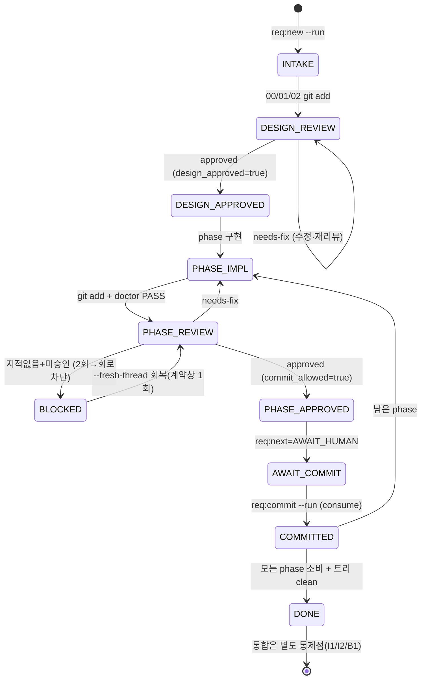
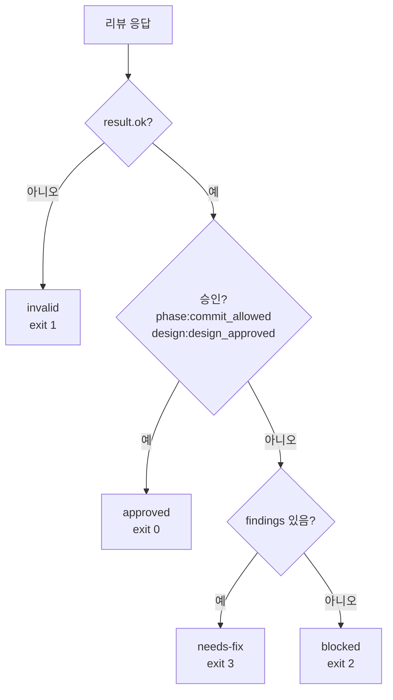
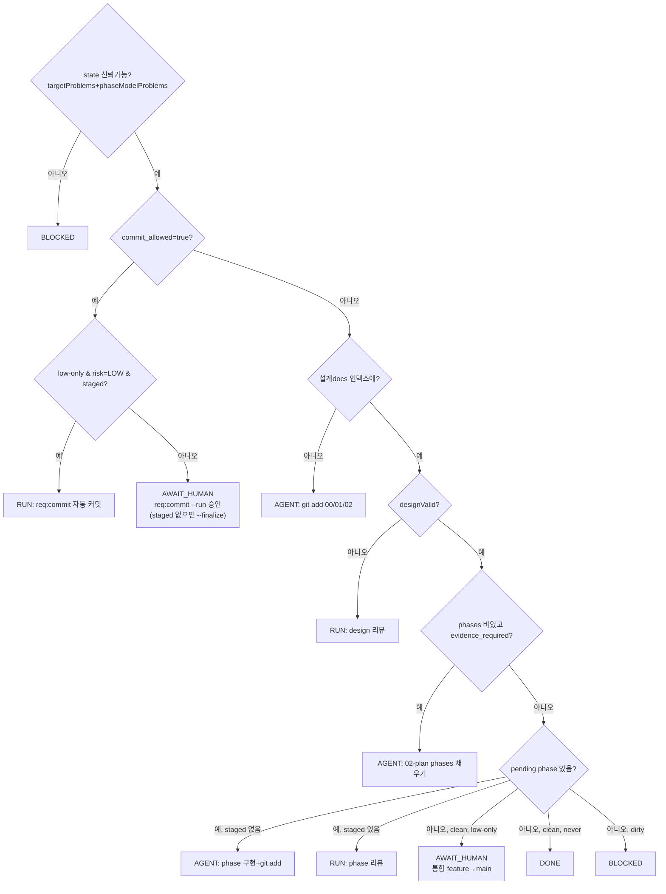

# 07. 업무 규칙·상태 머신

CommitGate의 "업무 규칙"은 커밋을 통과/차단하는 fail-closed 게이트다. 계산식·가격 같은 도메인 규칙은 없다(`해당 없음`). 대신 **승인 바인딩, findings⟺승인 불변식, D-체크, 상태 머신**이 핵심이다.

## 1. 리뷰 승인 불변식(가장 중요)

`validateVerdict`([scripts/req/review-codex.ts](../../scripts/req/review-codex.ts))가 강제한다.

| 규칙 | 조건 | 결과 |
|---|---|---|
| 스키마 버전 | `machine_schema_version === "1.1"` 아니면 | 무효 |
| base 일치 | `review_base_sha` ≠ 리뷰 시점 캡처한 현재 HEAD SHA(`captureGitBinding`) | 무효(`state ≠ resp`) |
| NEEDS_FIX 실체 | `status=NEEDS_FIX`인데 `findings=[]` 또는 `next_action` 공백 | 무효 |
| 교차모순 1 | `commit_approved=yes` && `status=NEEDS_FIX` | 무효 |
| 교차모순 2 | `merge_ready=yes` && `status≠COMPLETE` | 무효 |
| 교차모순 3 | `merge_ready=yes` && `commit_approved≠yes` | 무효 |
| **R10** | `commit_approved=yes` && `findings≠[]` | 무효(승인은 0 findings일 때만) |

리뷰어 페르소나([workflow/review-persona.md](../../workflow/review-persona.md))가 이 불변식을 의미론적으로 뒷받침한다: `findings`에는 "지금 커밋하면 안 되는 이유"만, `observations`에는 비차단 의견만. "무엇을 findings에 넣는가"의 결정이 곧 승인 결정이다.

### 1.1 차단 채널은 P1 전용 — 의미론이 아니라 구조로 강제(REQ-2026-018)

위 불변식은 **"findings에 무엇을 넣을지"를 리뷰어가 옳게 판단한다**는 전제에 서 있었고, 그 전제가 깨지면 승인이 영영 나지 않는다. 실제로 깨졌다 — REQ-2026-014 설계 리뷰 r20~r30의 findings 21건이 전부 P2였다(P1 0건).

의미론적 지시(persona)만으로는 부족했으므로, 이제 **출력 스키마가 구조적으로 강제**한다.

- 리뷰어에게 주는 출력 스키마의 `findings[].severity`는 **`P1`만** 허용 → P2/P3는 `observations`로 갈 수밖에 없다([06 §2.2](06-api-and-integration-contracts.md)).
- P1 정의(카테고리 한정·정상 경로·재현 증거·배제 규칙)는 `severity.description`에 담겨 같은 파생 copy로 전달된다([03 §4.2](03-domain-and-data-model.md)).
- persona는 이제 **보장 범위 경계**(단일 활성 worktree·협조적 작업자·정상 경로 우선)와 P1 정의를 **상단 프레임**에 둔다. "부채가 남지 않도록 하라"는 "부채는 `observations`에 기록해 다음 티켓의 입력으로"로 바뀌었다 — 탐색 범위를 넓히라는 지시는 유지하되 **차단 범위와 분리**한다.

> **R10과 `classifyReview`는 바뀌지 않았다**(§4). findings에 P1만 들어오면 "findings 있으면 차단"은 **이미 옳은 로직**이기 때문이다. 상태 전이·해시 비교 로직에 손대지 않은 것이 REQ-2026-018이 수렴한 조건이었다(REQ-2026-015/016/017은 그 지점을 건드리다 terminal 폐기).

## 2. 승인 바인딩과 stale 탐지

| 종류 | 바인딩 값 | 저장 | 무효화(stale) 조건 |
|---|---|---|---|
| **phase 승인** | staged 트리 OID(`git write-tree`) | `approved_diff_hash`, `approval_evidence.approved_tree` | 커밋 직전 재계산 트리 ≠ 바인딩 → stale, 재리뷰 |
| **design 승인** | `git ls-files -s -- 00/01/02` 정렬 sha256 | `design_approved_hash`, `design_approval_evidence.design_hash` | 현재 설계 해시 ≠ 저장 해시 → 무효 |

- phase stale 강제: `req:commit`이 `git write-tree` 재계산 후 `approved_diff_hash`와 불일치면 throw(`stale 승인, 재리뷰 필요`); `req:doctor` D9(`finalizeD9Check`)도 동일.
- design 신선도: `design_approved && design_approved_hash === currentDesignHash`일 때만 유효 — `req:next`(분기 3)·`req:doctor` D13·`review-codex` phase 선행조건에서 검사.
- 진행 원장: `consumed_approvals[]`(append-only, `req:commit`만 기록)가 phase 진행 SSOT. **`phases[].approved`(sticky)가 아니다** — 이후 NEEDS_FIX가 나도 소비 이력은 원장 기준.

## 3. D-체크 전수([scripts/req/req-doctor.ts](../../scripts/req/req-doctor.ts) `runChecks`)

레벨: `OK`/`WARN`/`FAIL`. FAIL 1건 이상이면 exit 1. 구현된 검사는 아래 표의 13개(`D2`·`D3`·`D5`·`D6`·`D9`·`D10`·`D11`·`D13`·`D15`~`D19`)뿐이다. **`D1`/`D4`/`D4a`/`D7`/`D7b`/`D8`/`D12`/`D14`는 예약된 결번**이며 재사용하지 않는다 — D1/D7/D4a 등 레지스트리·머지 의존 검사가 후속 단계로 유보되면서 비었다. **`D19`(설치 모드)가 REQ-2026-014에서 신설된 번호**다(직전 구현 최대는 D18).

> **번호 공간 주의**: 설계 결정 ID와 doctor D-체크 ID는 번호가 겹치지만 다른 개념이다([00-document-control.md](00-document-control.md) 용어표 하단 주의). 특히 [bin/init.ts](../../bin/init.ts) `runInit` preflight 순서를 가리키는 "D19 → D14"는 **REQ-2026-014의 설계 결정 ID**이고, 아래 표의 doctor D19와 같은 것이 아니다(doctor 공간에서 D14는 결번).

| ID | 검사 | FAIL 조건 |
|---|---|---|
| **D2** | 브랜치 일치 | `state.branch` 있고 현재 브랜치 ≠ state.branch |
| **D3** | 브랜치 로컬 존재 | `state.branch` 있고 `refs/heads/<branch>` 부재 |
| **D5** | thread id 형식 | `codex_thread_id`가 비공백인데 UUID 형식 아님 |
| **D6** | 승인 실체 재검증(when `commit_allowed`) | 응답 부재/손상, 구조 실패, verdict 오류, `commit_approved≠yes`, status 비승인, base/diff 해시 누락, `approved_diff_hash≠review_diff_hash` |
| **D9** | 승인 트리 일치(when `commit_allowed`) | staged tree ≠ `approved_diff_hash`(finalize면 소스커밋 트리 기준); `commit_allowed`인데 `approved_diff_hash` 없음 |
| **D10** | clean-tree | scratch 아닌 미스테이지/미추적 존재 |
| **D11** | feature branch | `phase≠DONE` && (현재=`main` 또는 branch가 prefix 미시작) |
| **D13** | 설계 우선 | 유효 design 승인 없이 **허용 목록 외 변경** 존재. 허용 목록 = 현재 티켓의 00/01/02·`codex-request.md` + scratch + 현재 티켓 `responses/` 아카이브 scratch뿐. 따라서 다른 REQ의 문서·증거 변경도 `codeChanges`로 잡혀 차단된다 |
| **D15** | NEEDS_FIX 실행가능성 | 응답 status=NEEDS_FIX인데 findings 비었거나 next_action 공백 |
| **D16** | phase 증거 아카이브(when `commit_allowed`) | 필수인데 증거 문제(경로/sha/구조/verdict/base/tree/live-sha 불일치) |
| **D17** | design 증거 아카이브(when `design_approved`) | D16과 동형(design_hash 기준) |
| **D18** | granularity | (WARN 전용, FAIL 아님) 변경 파일 > `granularityMaxFiles`(기본 8) |
| **D19** | 설치 모드(`req:*` 값의 형태) | **(WARN 상한, FAIL 아님) 없음.** `mixed`(Stage A·Stage B 형태 혼재)만 WARN + `commitgate migrate` 안내. `stage-a`/`stage-b`/`none`/`custom`은 OK |

증거 검증 세부(`evidenceProblems`): 경로 confinement(`<ticketRel>/responses/` 직속·아카이브명), `archive.sha256===ev.response_sha256`, 구조 OK, verdict가 같은 kind의 승인, `review_base_sha` 일치, phase면 `approved_tree===state.approved_diff_hash`, **live `codex-response.json` sha===ev.response_sha256**(손편집 탐지, phase), design이면 `design_hash===state.design_approved_hash`.

### 3.1 D19 설치 모드 진단 세부 (REQ-2026-014)

`classifyInstallMode`([scripts/req/req-doctor.ts](../../scripts/req/req-doctor.ts))는 대상 `package.json`의 `req:*` **값의 형태만**으로 다섯 모드를 분류한다. `main()`이 읽어 `DoctorInputs.reqScripts`에 채우고 `runChecks`는 순수하게 판정한다.

| 모드 | 판정 | level |
|---|---|---|
| `stage-b` | `req:*` 값이 전부 `commitgate <verb>` 형태 | OK |
| `stage-a` | `req:*` 값이 전부 `tsx scripts/req/<file>.ts` 형태 | **OK**(지원되는 설치 형태) |
| `mixed` | 두 형태가 섞여 있음 | **WARN** + `commitgate migrate` 안내 |
| `none` | `req:*` 키 없음 | OK |
| `custom` | kit 형태가 아닌 사용자 값(일부만 kit 형태인 경우 포함) | OK |

- 🔴 **FAIL이 될 수 없다 — WARN이 상한이다.** CommitGate 자신의 `package.json`이 Stage A 형태이고([package.json](../../package.json) `scripts.req:new = tsx scripts/req/req-new.ts` — 개발 repo가 자기 스크립트를 직접 실행하므로 정상), `req:commit`이 이 doctor를 **exit≠0에 throw하는 하드 게이트로 spawn**한다([scripts/req/req-commit.ts](../../scripts/req/req-commit.ts) `runDoctor`). 따라서 FAIL 레벨이면 **이 저장소 자신의 커밋과 정당한 Stage A 소비자 전원의 커밋이 영구 차단**된다. Stage A는 결함이 아니라 **지원되는 설치 형태**이므로 `mixed`만 WARN한다.
- **검증하지 않는 것**: manifest·lockfile·`node_modules`·버전 skew. 형태 판정뿐인 **읽기 전용 advisory**다(자산↔런타임 skew 자동 감지 수단은 없다 — [08 §5.2](08-architecture-and-module-spec.md)).
- **`bin/init.ts`를 import하지 않는다**(레이어 역전 방지) → 바이트 일치(`REQ_SCRIPTS`)가 아니라 shape 판정. 반대로 **쓰기**를 하는 `decideScripts`([bin/migrate.ts](../../bin/migrate.ts))는 사용자 값을 덮지 않기 위해 바이트 정확 일치를 요구한다 — 이 비대칭은 의도적이다.
- `reqScripts`가 `undefined`(main이 미조회)거나 `null`(package.json 없음·파손)이면 OK '점검 불요'. 파손을 여기서 throw하면 무관한 이유로 커밋 게이트가 죽으므로 fail-closed 대상이 아니다(그 사실은 `init`·`migrate`가 알린다).

## 4. 상태 머신 A — 파생된 논리 수명주기

아래 상태 이름은 `req:next`와 사용자 여정을 설명하기 위한 **파생 모델**이다. 각 화살표가 `state.json.phase` 쓰기를 의미하지 않는다. 현재 코드에서 `phase`는 `req:new`이 `INTAKE`로 만들고 review/commit/next가 자동 변경하지 않는다. 실제 전이는 `design_approved`, 설계 해시 신선도, `commit_allowed`, `current_phase`, `consumed_approvals`, staged/working tree 상태로 판정한다.

`state.phase`는 현재 자동 수명주기 상태가 아니다. doctor D11은 이 값이 수동으로 `DONE`이 되지 않는 한 feature branch 제약을 계속 적용한다. 논리 완료는 `req:next`가 남은 phase와 git clean 상태를 보고 `DONE`을 반환하는 것이며, 그 반환도 state를 쓰지 않는다.

### 4.1 상태 필드와 논리 상태의 대응

| 논리 상태 | 최소 판정 신호 | `state.phase` 자동 변경 |
|---|---|---|
| DESIGN_REVIEW | 설계 docs가 index에 있고 유효 design 승인 없음 | 없음 |
| DESIGN_APPROVED | `design_approved=true` + 현재 design hash 일치 | 없음 |
| PHASE_IMPL | 유효 design 승인 + 미소비 phase + staged 변경 없음 | 없음 |
| PHASE_REVIEW | 유효 design 승인 + 미소비 phase + staged 변경 있음 | 없음 |
| PHASE_APPROVED/AWAIT_COMMIT | `commit_allowed=true` + 증거/바인딩 유효 | 없음 |
| COMMITTED | 해당 `phase_id`가 `consumed_approvals[]`에 존재 | 없음 |
| DONE | 미소비 phase 없음 + 비-scratch dirty 없음 | 없음(`req:next` 출력만) |

재구현은 이 파생 모델을 유지하거나 명시적 상태 머신으로 마이그레이션할 수 있지만, 후자는 state schema version·기존 티켓 마이그레이션·D11 의미 변경이 필요한 **새 설계**다.

## 5. 상태 머신 B — 리뷰 outcome 분류

`classifyReview`([scripts/req/review-codex.ts](../../scripts/req/review-codex.ts))는 **findings 존재 기준**(status 기준 아님)으로 분류한다.

`blocked`는 "미승인 + findings=[]"인 모순 상태에서만 발생한다. `resolveReviewOutcome`이 blocked면 `recordBlockedReview`, 그 외엔 `clearBlockedReview`, 항상 `last_review` 기록.

## 6. 상태 머신 C — `req:next` 결정(첫 매치 우선)

`resolveNext`([scripts/req/req-next.ts](../../scripts/req/req-next.ts)) 분기 순서:

`gateRunCandidate`의 두 게이트:
- **G1**: 워킹트리 미-clean → AGENT(리뷰 D10 실패 예방).
- **G2**(outcome 인지 신선도): `last_review`가 같은 `(kind,phase_id,compare_hash)`면 outcome별 분기 — `needs-fix`→AGENT, `blocked`→BLOCKED(재시도 금지), `invalid`→2회 이상이면 BLOCKED 아니면 RUN(1회 재시도), `approved`→BLOCKED(방어적: 승인인데 state 미반영=손상). 그 외 → RUN. 이는 **무한 재리뷰 루프 차단기**다.

## 7. 회로차단(blocked circuit-breaker)
- `shouldShortCircuitBlockedReview(state, target, limit=2)`: 같은 대상(`review_binding` = design→designHash, phase→reviewTree)이 2회 이상 blocked면 codex 호출 없이 exit 2.
- 회복: 사람이 `--fresh-thread`(마커 clear + 새 스레드). `clearBlockedReview`는 마커만 제거하고 사용 횟수를 세지 않는다 — "1회만"은 [AGENTS.template.md](../../AGENTS.template.md) §3의 계약 지침이다. 그래도 blocked면 사람 보고.

## 8. 피처 플래그·한도 요약

| 항목 | 값/규칙 | 근거 |
|---|---|---|
| phase 변경 파일 권고 상한 | 8(WARN, `granularityMaxFiles`) | `req-doctor` D18 |
| blocked 회로차단 임계 | 2 | `shouldShortCircuitBlockedReview` |
| findings 스냅샷 상한 | 10건/detail 300B/총 4096B | `SNAPSHOT_MAX_*` |
| last_review 오류 상한 | 20건/각 500B | `LAST_REVIEW_MAX_*` |
| cross-spawn 하한 | `^7.0.6`(floor 7.0.6) | `bin/init.ts CROSS_SPAWN_SPEC` |
| git maxBuffer | 64 MiB | `GIT_MAX_BUFFER` |
| trunk 브랜치 | `main`(하드코딩) | `req-next`/`req-doctor` — [gaps-and-decisions.md](gaps-and-decisions.md) |
