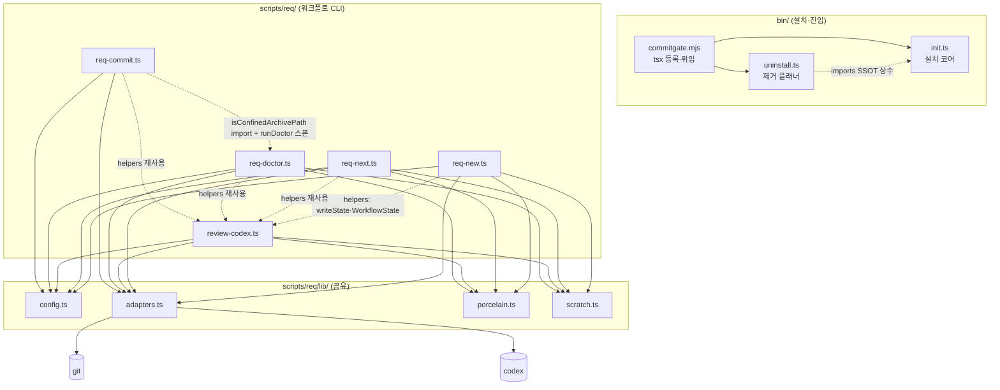
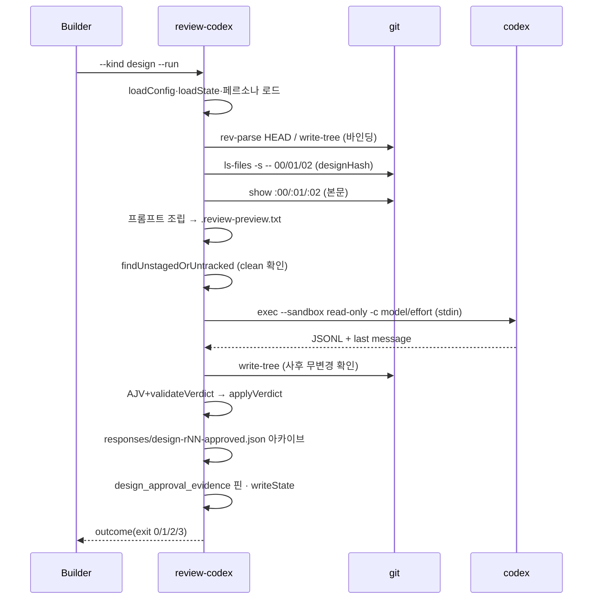
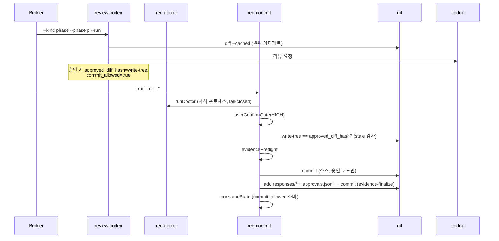

# 08. 아키텍처·모듈 명세

## 1. 런타임 구성 개요

CommitGate는 **로컬 CLI 프로세스**의 집합이다. 서버·데몬·장기 실행 컴포넌트가 없다. 각 명령은 짧게 실행되고 종료하며, 상태는 전부 파일(git 저장소)에 있다. 외부 프로세스로 `git`(항상)과 `codex`(리뷰 시)를 스폰한다.

의존 방향: 모든 명령 → lib → 프로세스(git/codex). 단 lib 중 **config·adapters는 5개 명령 전부**가 직접 import하고, **porcelain·scratch는 `req-new`·`req-next`·`review-codex`·`req-doctor` 4개만** 직접 import한다(`req-commit`은 porcelain·scratch를 직접 import하지 않고 `review-codex`/`req-doctor`를 통해 간접 사용). 추가로 **명령 계층 내부에 공유 헬퍼 허브**가 있다 — `review-codex.ts`가 `writeState`·`WorkflowState`와 바인딩/검증 헬퍼를 export하고 `req-new`·`req-next`·`req-doctor`·`req-commit`이 모두 이를 import한다([scripts/req/req-new.ts](../../scripts/req/req-new.ts):15 `import { writeState, type WorkflowState } from './review-codex'` 등). 또 `req-commit`은 `req-doctor`의 `isConfinedArchivePath`를 import하고 실행 시 `req-doctor`를 자식 프로세스로 스폰한다. 방향은 항상 `→ review-codex`(그리고 `req-commit → req-doctor`)로 단일하여 **순환 의존은 없다.** `uninstall.ts`는 `init.ts`의 SSOT 상수를 import해 설치기·제거기 간 드리프트를 원천 차단한다.

## 2. 모듈별 명세

### 2.1 `lib/config.ts` — 설정 SSOT
- **책임**: `req.config.json` 로드·검증·경로 confinement, `DEFAULTS` 병합, pm별 스크립트 호출 조립.
- **공개 인터페이스**: `loadConfig(opts): ResolvedConfig`, `resolveRoot`, `buildScriptInvocation(pm, script, args)`, `DEFAULTS`, `DEFAULT_REVIEW_PERSONA_RELPATH`, `CONFIG_SCHEMA`.
- **소유 데이터**: 없음(파싱만). **의존**: `ajv`(간접), fs.
- **오류 처리**: 스키마 위반·경로 이탈 → throw(fail-closed). nullable은 `!==undefined` 병합으로 명시적 null 보존.

### 2.2 `lib/adapters.ts` — 프로세스 경계
- **책임**: shell 없는 안전 spawn, git/codex 어댑터.
- **공개 인터페이스**: `safeSpawnSync`, `createGitAdapter(root, run?)`, `createCodexReviewerAdapter(run?)`, `createFakeReviewerAdapter(result)`(테스트 더블), `parseThreadId`, `deriveStrictOutputSchema`.
- **의존**: `cross-spawn`, node fs/os/crypto. **리프 모듈**(req 스크립트 의존 없음).
- **오류 처리**: `res.error` 또는 `status!==0` → throw `명령 실패(exit=...)`.

### 2.3 `lib/porcelain.ts` — git status 파서
- **책임**: `git status --porcelain=v1 -z --untracked-files=all` 디코딩 단일 지점.
- **공개**: `parseStatusZ`, `entryPaths`, `isUntracked`, `isRenameOrCopy`, `formatStatusEntry`, `STATUS_Z_ARGS`.
- **오류**: 레코드 형식 오류·truncated rename → throw.

### 2.4 `lib/scratch.ts` — scratch 판정 SSOT
- **책임**: clean-tree에서 무시할 도구 산출물 정의(두 범위: 현재 티켓 리뷰 scratch vs req:new 넓은 예외).
- **공개(export)**: `reviewScratchPaths`, `TOOL_OUTPUT_BASENAMES`, `isToolOutputScratch`, `isAllowedResponsesScratch`, `isArchiveFileName`. (`ARCHIVE_NAME_RE`은 export되지 않는 모듈 내부 `const`이며 `isArchiveFileName`을 통해서만 노출된다.)
- **핵심 안전**: `state.json`·`responses/**`는 req:new 예외에서 **제외**(증거 변조 구멍 차단). responses/ scratch는 미추적 아카이브 1개만 허용.

### 2.5 `req-new.ts` — 티켓 생성
- **책임**: REQ 채번, 브랜치·티켓·문서·초기 state 생성, 스캐폴드 커밋.
- **공개(테스트 대상)**: `validateSlug`, `nextReqId`, `branchName`, `buildInitialState`, `findReqNewDirtyEntries`.
- **의존**: config, adapters, porcelain, scratch, **review-codex(`writeState`·`WorkflowState`)**. **부작용**: 브랜치·파일·커밋.

### 2.6 `req-next.ts` — 결정 엔진(읽기 전용)
- **책임**: state+git → 다음 행동(kind). **쓰기 없음**(`createReadOnlyGit` 허용목록 + `--no-optional-locks`).
- **공개**: `resolveNext`, `NEXT_EXIT_CODES`, `nextPhaseId`, `createReadOnlyGit`.
- **소유 데이터**: 없음. **오류**: state 신뢰불가 → BLOCKED(진단 포함).

### 2.7 `review-codex.ts` — 리뷰 오케스트레이터
- **책임**: 프롬프트 조립, 바인딩 캡처, codex 호출, 응답 검증(AJV+도메인), verdict 적용, 아카이브, 증거 핀.
- **공개(재사용)**: `validateVerdict`, `validateResponseStructure`, `captureGitBinding`, `captureDesignBinding`, `captureIndexHash`, `findUnstagedOrUntracked`, `applyVerdict`, `classifyReview`, `REVIEW_EXIT_CODES`, `loadReviewPersona`, `writeState`, `loadState`.
- **의존**: 전 lib + codex. **오류**: 페르소나/응답/바인딩 이상 → throw 또는 비-0 exit.

### 2.8 `req-doctor.ts` — 일관성 게이트
- **책임**: D-체크 실행, FAIL 시 exit 1. `review-codex` 헬퍼 재사용.
- **공개(export)**: `runChecks`, `finalizeD9Check`, `phaseGranularityWarnings`. (`evidenceProblems`은 export되지 않는 모듈 내부 함수로, D16/D17 검사가 내부에서 호출한다.)
- **부작용**: 티켓 상태·소스 파일 변경 없음(검사만, 자동 수정 없음). 단 `req:next`와 달리 read-only git 어댑터를 쓰지 않으므로, `git write-tree`가 `.git/objects`에 tree object를, `git status`가 `.git/index` stat-cache를 갱신할 수 있다.

### 2.9 `req-commit.ts` — 커밋 래퍼
- **책임**: doctor 게이트 → HIGH 확인 → 소스 커밋 → evidence-finalize → consume. 복구/설계확정 모드.
- **공개(테스트)**: `buildManifestEntry`, `validateManifest`, `consumeState`, `userConfirmGate`, `evidencePreflight`, `resolveMessageSource`, `buildCommitArgs`, `resolveRecoverySource`.
- **부작용**: 2커밋 + state 쓰기. `req:doctor`를 자식 프로세스로 스폰(fail-closed).

### 2.10 `bin/init.ts` / `bin/uninstall.ts` / `bin/commitgate.mjs`
- **init**: 프리플라이트(git·package.json·cross-spawn·gitignore·더티) → Apply(복사·주입). SSOT 상수(`KIT_*`, `REQ_SCRIPTS`, `REQ_DEV_DEPS`) 정의.
- **uninstall**: init의 SSOT 상수 import, 파일 분류(identical/differs/ambiguous/evidence/unknown), 도입 커밋 탐색, 계획 출력. **쓰기 API 미import(구조적 계약)**.
- **commitgate.mjs**: `tsx/esm/api` register 후 `uninstall` 토큰이면 uninstall.ts, 아니면 init.ts로 위임. 플래그 파싱은 하지 않음.

## 3. end-to-end 시퀀스

### 3.1 설계 리뷰(`req:review-codex --kind design --run`)

### 3.2 phase 리뷰 → 커밋

## 4. 일관성·장애 경계
- **캐시/큐/외부 스토리지 없음** — 상태는 오직 git + 티켓 파일. 동시성 이슈는 단일 로컬 사용자 가정으로 최소화(`추론`).
- **git 인덱스 stat-cache**: `req:next`는 `--no-optional-locks`로 인덱스 재기록을 방지(읽기 순수성 보장).
- **codex 장애**: fail-closed throw. 부분 승인 없음.
- **아카이브 쓰기 실패**: swallow되어 증거가 핀되지 않음 → 다음 doctor/commit에서 증거 부재로 차단(`추론` — 안전 방향).
- **evidence-finalize 중단 복구**: `pending_evidence_for` 마커 + `--finalize`(고아 소스 커밋 복구 포함)로 재개.
