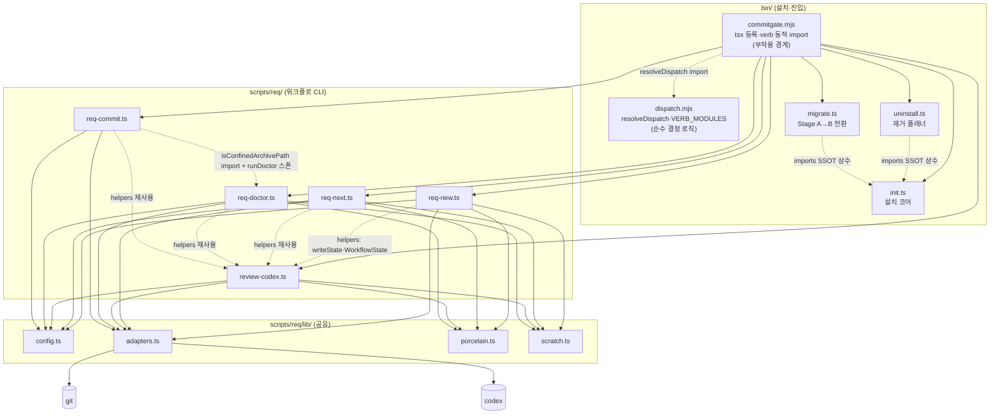
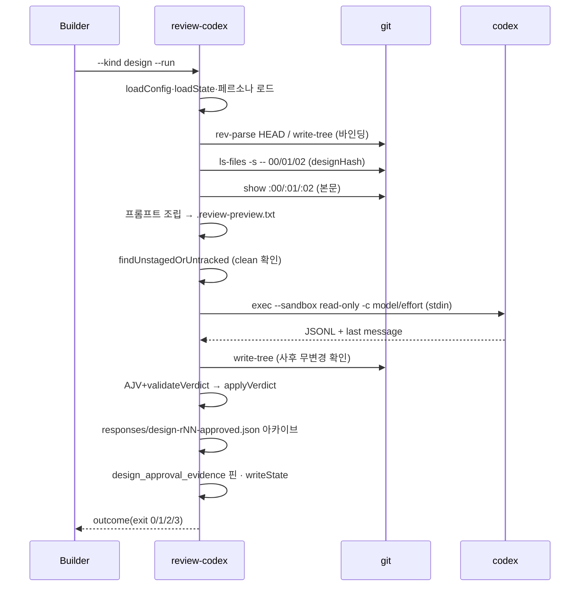
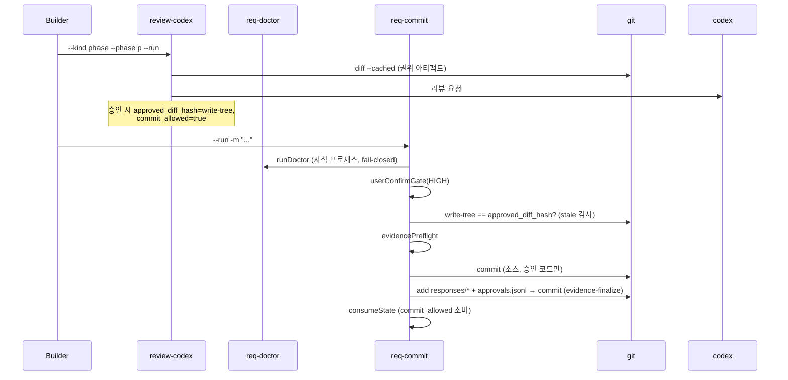

# 08. 아키텍처·모듈 명세

## 1. 런타임 구성 개요

CommitGate는 **로컬 CLI 프로세스**의 집합이다. 서버·데몬·장기 실행 컴포넌트가 없다. 각 명령은 짧게 실행되고 종료하며, 상태는 전부 파일(git 저장소)에 있다. 외부 프로세스로 `git`(항상)과 `codex`(리뷰 시)를 스폰한다.

의존 방향: 모든 명령 → lib → 프로세스(git/codex). 단 lib 중 **config·adapters는 5개 명령 전부**가 직접 import하고, **porcelain·scratch는 `req-new`·`req-next`·`review-codex`·`req-doctor` 4개만** 직접 import한다(`req-commit`은 porcelain·scratch를 직접 import하지 않고 `review-codex`/`req-doctor`를 통해 간접 사용). 추가로 **명령 계층 내부에 공유 헬퍼 허브**가 있다 — `review-codex.ts`가 `writeState`·`WorkflowState`와 바인딩/검증 헬퍼를 export하고 `req-new`·`req-next`·`req-doctor`·`req-commit`이 모두 이를 import한다([scripts/req/req-new.ts](../../scripts/req/req-new.ts):15 `import { writeState, type WorkflowState } from './review-codex'` 등). 또 `req-commit`은 `req-doctor`의 `isConfinedArchivePath`를 import하고 실행 시 `req-doctor`를 자식 프로세스로 스폰한다. 방향은 항상 `→ review-codex`(그리고 `req-commit → req-doctor`)로 단일하여 **순환 의존은 없다.** `uninstall.ts`와 `migrate.ts`는 `init.ts`의 SSOT 상수(`REQ_SCRIPTS`·`KIT_*`)를 import해 설치기·제거기·전환기 간 드리프트를 원천 차단한다.

**Stage B에서 `bin/`은 설치 진입점이자 워크플로 진입점이다**(REQ-2026-014). 대상 저장소의 `req:*`가 `commitgate <verb>`이므로 다섯 워크플로 CLI도 이 런처를 거쳐 **패키지 안에서** 실행된다 — 대상에 복사된 사본이 아니다. `bin/` 내부는 **결정과 부작용이 분리**돼 있다: [bin/dispatch.mjs](../../bin/dispatch.mjs)의 `resolveDispatch`·`VERB_MODULES`는 argv→모듈 결정만 하는 순수 함수라 프로세스 없이 검증되고([tests/unit/dispatch.test.ts](../../tests/unit/dispatch.test.ts)), [bin/commitgate.mjs](../../bin/commitgate.mjs)는 `tsx/esm/api` register와 동적 import라는 부작용만 담당한다.

## 2. 모듈별 명세

### 2.1 `lib/config.ts` — 설정 SSOT
- **책임**: `req.config.json` 로드·검증·경로 confinement, `DEFAULTS` 병합, pm별 스크립트 호출 조립.
- **공개 인터페이스**: `loadConfig(opts): ResolvedConfig`, `resolveRoot`, `buildScriptInvocation(pm, script, args)`, `DEFAULTS`, `DEFAULT_REVIEW_PERSONA_RELPATH`, `CONFIG_SCHEMA`.
- **소유 데이터**: 없음(파싱만). **의존**: `ajv`(간접), fs.
- **오류 처리**: 스키마 위반·경로 이탈 → throw(fail-closed). nullable은 `!==undefined` 병합으로 명시적 null 보존.

### 2.2 `lib/adapters.ts` — 프로세스 경계
- **책임**: shell 없는 안전 spawn, git/codex 어댑터.
- **공개 인터페이스**: `safeSpawnSync`, `createGitAdapter(root, run?)`, `createCodexReviewerAdapter(run?)`, `createFakeReviewerAdapter(result)`(테스트 더블), `parseThreadId`, `deriveStrictOutputSchema`.
- **의존**: `cross-spawn`, node fs/os/crypto. **리프 모듈**(req 스크립트 의존 없음).
- **오류 처리**: `res.error` 또는 `status!==0` → throw `명령 실패(exit=...)`.

### 2.3 `lib/porcelain.ts` — git status 파서
- **책임**: `git status --porcelain=v1 -z --untracked-files=all` 디코딩 단일 지점.
- **공개**: `parseStatusZ`, `entryPaths`, `isUntracked`, `isRenameOrCopy`, `formatStatusEntry`, `STATUS_Z_ARGS`.
- **오류**: 레코드 형식 오류·truncated rename → throw.

### 2.4 `lib/scratch.ts` — scratch 판정 SSOT
- **책임**: clean-tree에서 무시할 도구 산출물 정의(두 범위: 현재 티켓 리뷰 scratch vs req:new 넓은 예외).
- **공개(export)**: `reviewScratchPaths`, `TOOL_OUTPUT_BASENAMES`, `isToolOutputScratch`, `isAllowedResponsesScratch`, `isArchiveFileName`. (`ARCHIVE_NAME_RE`은 export되지 않는 모듈 내부 `const`이며 `isArchiveFileName`을 통해서만 노출된다.)
- **핵심 안전**: `state.json`·`responses/**`는 req:new 예외에서 **제외**(증거 변조 구멍 차단). responses/ scratch는 미추적 아카이브 1개만 허용.

### 2.5 `req-new.ts` — 티켓 생성
- **책임**: REQ 채번, 브랜치·티켓·문서·초기 state 생성, 스캐폴드 커밋.
- **공개(테스트 대상)**: `validateSlug`, `nextReqId`, `branchName`, `buildInitialState`, `findReqNewDirtyEntries`.
- **의존**: config, adapters, porcelain, scratch, **review-codex(`writeState`·`WorkflowState`)**. **부작용**: 브랜치·파일·커밋.

### 2.6 `req-next.ts` — 결정 엔진(읽기 전용)
- **책임**: state+git → 다음 행동(kind). **쓰기 없음**(`createReadOnlyGit` 허용목록 + `--no-optional-locks`).
- **공개**: `resolveNext`, `NEXT_EXIT_CODES`, `nextPhaseId`, `createReadOnlyGit`.
- **소유 데이터**: 없음. **오류**: state 신뢰불가 → BLOCKED(진단 포함).

### 2.7 `review-codex.ts` — 리뷰 오케스트레이터
- **책임**: 프롬프트 조립, 바인딩 캡처, codex 호출, 응답 검증(AJV+도메인), verdict 적용, 아카이브, 증거 핀.
- **공개(재사용)**: `validateVerdict`, `validateResponseStructure`, `captureGitBinding`, `captureDesignBinding`, `captureIndexHash`, `findUnstagedOrUntracked`, `applyVerdict`, `classifyReview`, `REVIEW_EXIT_CODES`, `loadReviewPersona`, `writeState`, `loadState`.
- **의존**: 전 lib + codex. **오류**: 페르소나/응답/바인딩 이상 → throw 또는 비-0 exit.

### 2.8 `req-doctor.ts` — 일관성 게이트
- **책임**: D-체크 실행, FAIL 시 exit 1. `review-codex` 헬퍼 재사용.
- **공개(export)**: `runChecks`, `finalizeD9Check`, `phaseGranularityWarnings`. (`evidenceProblems`은 export되지 않는 모듈 내부 함수로, D16/D17 검사가 내부에서 호출한다.)
- **부작용**: 티켓 상태·소스 파일 변경 없음(검사만, 자동 수정 없음). 단 `req:next`와 달리 read-only git 어댑터를 쓰지 않으므로, `git write-tree`가 `.git/objects`에 tree object를, `git status`가 `.git/index` stat-cache를 갱신할 수 있다.

### 2.9 `req-commit.ts` — 커밋 래퍼
- **책임**: doctor 게이트 → HIGH 확인 → 소스 커밋 → evidence-finalize → consume. 복구/설계확정 모드.
- **공개(테스트)**: `buildManifestEntry`, `validateManifest`, `consumeState`, `userConfirmGate`, `evidencePreflight`, `resolveMessageSource`, `buildCommitArgs`, `resolveRecoverySource`.
- **부작용**: 2커밋 + state 쓰기. `req:doctor`를 자식 프로세스로 스폰(fail-closed).

### 2.10 `bin/dispatch.mjs` / `bin/commitgate.mjs` / `bin/init.ts` / `bin/migrate.ts` / `bin/uninstall.ts`

- **dispatch.mjs**: `resolveDispatch(argv)` → `{entry, rest}` 또는 `{unknown}`. **부작용 없는 순수 결정 로직**이라 런처와 유닛 테스트가 공유한다. verb 표의 SSOT는 `VERB_MODULES`다:

  | `argv[0]` | 위임 대상 | 비고 |
  |---|---|---|
  | `req:new`·`req:next`·`req:review-codex`·`req:doctor`·`req:commit` | `../scripts/req/<모듈>.ts` | **패키지 안**에서 실행(Stage B 무복사) |
  | `init` | `init.ts` | |
  | `migrate` | `migrate.ts` | |
  | `uninstall` | `uninstall.ts` | |
  | 없음, 또는 `-`로 시작 | `init.ts`(argv **전체** 전달) | 하위호환 — `npx commitgate --dry-run` 등 |
  | 그 외 비-옵션 토큰 | `{unknown}` → **fail-closed** | 오타를 조용히 init으로 보내지 않는다 |

  알려진 verb는 토큰을 소비하고 나머지만 `rest`로 넘긴다. 각 대상 모듈은 `runCli(argv)`(예외 → 1줄 메시지 + exit 1 경계)를 export한다.
- **commitgate.mjs**: `tsx/esm/api` `register()` 후 `resolveDispatch` 결과를 **동적 import**해 `runCli(rest)` 호출, `unknown`이면 1줄 오류 + exit 1. 플래그 파싱은 하지 않는다(각 모듈 `parseArgs`의 책임). ⚠️ `runCli`를 **await 없이** 호출하므로 대상 모듈은 전부 sync여야 한다 — async면 오류가 unhandledRejection이 되고 exit code가 소실된다.
- **init**: 프리플라이트(git work tree → package.json 존재·shape → **Stage B 전제** → cross-spawn 하한 → config 스키마 → dest confinement → gitignore·더티) → Apply(**관리 자산 배치** + `req:* = commitgate <verb>` 주입). 프리플라이트 throw 시 **파일을 하나도 쓰지 않는다**가 계약이다.
  - **Stage B 전제는 순서가 계약**이다: `detectStageA`(설계결정 D19 — Stage A 서명이면 무쓰기 중단 + `commitgate migrate` 안내) **→** `commitgateDeclared`(설계결정 D14 — `devDependencies.commitgate` **키 존재만** 확인, 값 형태는 미검증. `npm i -D <tgz>`는 `file:…tgz`를 쓴다). 뒤집으면 Stage A 설치본에는 `devDependencies.commitgate`가 **없으므로** 사용자가 항상 D14에서 먼저 죽어 migrate 안내에 영원히 도달하지 못한다. 여기의 D19/D14는 REQ-2026-014의 **설계 결정 ID**이며 doctor D-체크와 다른 번호 공간이다([07 §3](07-business-rules-and-state-machines.md)).
  - `planInstall`은 `scripts/req/**`를 **복사하지 않고**, `tsx`·`ajv`·`cross-spawn`을 **주입하지 않는다** — 런타임과 그 의존은 `commitgate` 패키지의 `dependencies`에 있다.
  - SSOT 상수: `KIT_*`(복사 축) · **`REQ_SCRIPTS` = Stage A 서명 SSOT**(`detectStageA`·`migrate`·`uninstall`이 바이트 정확 일치 판정에 사용 — "무엇을 주입하는가"가 아니라 **"과거에 무엇을 주입했는가"의 기록**) · **`STAGE_B_REQ_SCRIPTS`** = 실제 주입값(키는 `REQ_SCRIPTS`에서 파생해 SSOT 단일 유지) · **`REQ_DEV_DEPS`는 legacy 분류용으로만 남는다**(주입에 쓰이지 않고 `uninstall`이 Stage A 설치본 분류에 읽는다).
- **migrate**: `package.json`의 `req:*` 중 **현재 값이 정확히 Stage A 주입값인 키만** `commitgate <verb>`로 전환(`decideScripts` → `convert`/`stage-b`/`custom`/`absent`). 불변식: **기본 dry-run**(`--apply`에서만 쓰기) · 쓰기 범위 **`package.json` 한 파일**(그래서 다중 파일 rollback 프레임워크가 없다) · **비파괴**(`scripts/req/**`·스키마·persona·config·진입점·`workflow/REQ-*` 증거를 삭제하지 않고 안내만) · 사용자 정의 값 **미덮어씀**(보존 + 수동 조치 안내 — 한 글자만 달라도 사용자 값) · **커밋하지 않음** · **동기 구현**(런처가 await하지 않는다). `--apply` 전 `commitgateDeclared` 확인. 대상 root는 **`--dir`(기본 cwd)로만** 해소한다 — `resolveRoot` fallback을 타면 CommitGate 패키지 자신의 `package.json`을 재작성한다.
- **uninstall**: init의 SSOT 상수 import, 파일 분류(identical/differs/ambiguous/evidence/unknown), 도입 커밋 탐색, 계획 출력. **read-only 안내 전용** — `node:fs` 조회 API만 import하고(**쓰기 API 미import = 구조적 계약**) 삭제 플래그(`--run`/`--force`)가 **없다**. git은 read-only 서브커맨드 allowlist(`rev-parse`·`status`·`ls-files`·`log`)만, 해시는 `node:crypto`로 계산(`git hash-object`는 objects/에 쓸 수 있다). **npm을 spawn하지 않는다** — 런타임 제거(`npm uninstall -D commitgate`)는 **문자열로 출력만** 하고 사용자가 package manager로 실행한다.

## 3. end-to-end 시퀀스

### 3.1 설계 리뷰(`req:review-codex --kind design --run`)

### 3.2 phase 리뷰 → 커밋

## 4. 일관성·장애 경계
- **캐시/큐/외부 스토리지 없음** — 상태는 오직 git + 티켓 파일. 단 `state.json`의 런타임 변경은 git에 자동 내구화되지 않으므로 “git에 전부 재구축 가능”을 뜻하지 않는다. 동시성 이슈는 단일 로컬 사용자 가정으로 최소화(`추론`).
- **git 인덱스 stat-cache**: `req:next`는 `--no-optional-locks`로 인덱스 재기록을 방지(읽기 순수성 보장).
- **codex 장애**: fail-closed throw. 부분 승인 없음.
- **아카이브 쓰기 실패**: swallow되어 증거가 핀되지 않음 → 다음 doctor/commit에서 증거 부재로 차단(`추론` — 안전 방향).
- **evidence-finalize 중단 복구**: `pending_evidence_for` 마커 + `--finalize`(고아 소스 커밋 복구 포함)로 재개.

## 5. 아키텍처 평가

### 5.1 강점

- **불변 아티팩트 중심**: git tree·blob index·sha256을 경계 값으로 사용해 설명 문자열보다 강한 동일성을 얻는다.
- **순수 코어 분리**: `resolveNext`, `validateVerdict`, manifest·doctor 판정의 많은 부분이 fake adapter로 테스트 가능하다.
- **프로세스 경계 집중**: git/codex 실행을 adapter에 모아 shell 주입·Windows wrapper 회귀를 한 곳에서 통제한다.
- **읽기 전용 명령의 구조적 제한**: `req:next`는 허용 git subcommand를 코드로 제한해 우발 쓰기를 막는다.
- **실패 후 안전 방향**: 응답·증거·아카이브가 불완전하면 커밋이 열리는 대신 doctor/commit에서 닫힌다.

### 5.2 구조적 제약

- **`review-codex.ts`가 공유 도메인 허브이자 CLI 오케스트레이터**다. new/next/doctor/commit이 state type·바인딩·검증 헬퍼를 command 파일에서 import한다. 현재 순환은 없지만 CI verifier·state rebuild·provider 확장을 추가하면 결합도가 빠르게 커진다.
- **state 계약이 선언적 schema가 아니라 분산된 사용 지점 검증**에 있다. 필드 조합의 유효성을 한 곳에서 설명·버전 관리하기 어렵다.
- **증거 읽기 로직이 doctor/commit에 분산**되어 향후 CI verifier가 새 해석을 복제할 위험이 있다.
- **자산↔런타임 skew는 감지 수단이 없다.** Stage B(REQ-2026-014)가 실행 코드를 `node_modules/commitgate`로 옮기면서 vendored 사본(Stage A)의 문제 — 대상 repo마다 흩어진 실행 코드의 계약 버전·보안 패치를 일관되게 유지하기 어려움 — 은 줄었다. 런타임 갱신 지점이 package manager 하나로 모이기 때문이다. 그러나 대상에 남는 **관리 자산**(스키마·persona·config·계약·진입점)은 여전히 **설치 시점의 사본**이고, 패키지를 올려도 자동으로 따라오지 않는다. **그 skew를 감지하는 수단은 아직 없다** — doctor D19는 `req:*` 값의 형태만 보고 manifest·lockfile·`node_modules`·버전을 검증하지 않으며([07 §3.1](07-business-rules-and-state-machines.md)), 자산 업그레이드·3-way merge도 미구현이다.
- **Codex adapter와 외부 전송 정책이 같은 호출 경로에 결합**되어 payload manifest·scanner·격리 컨텍스트를 넣을 명시적 policy port가 없다.

### 5.3 목표 seam

목표 설계를 구현할 때 파일을 한 번에 재작성하지 않고 다음 seam을 먼저 추출한다.

| 목표 모듈 | 책임 | 소비자 |
|---|---|---|
| `domain/state` | versioned state/event type, reducer, invariant | next·review·doctor·repair |
| `domain/evidence` | archive/manifest 읽기·검증·commit 매핑 | doctor·commit·CI verify·report |
| `domain/policy` | profile, 전송·라운드·통제점 판정 | review·next·CI verify |
| `ports/reviewer` | provider 중립 request/result 계약 | Codex·향후 local/enterprise adapter |
| `ports/repository` | read-only/mutating git capability 분리 | 전 명령 |
| `application/*` | use-case orchestration, 오류 코드 | CLI·CI wrapper |

추출 순서는 **evidence reader → state reducer → policy evaluator → CLI adapter**가 안전하다. 먼저 증거 해석을 하나로 만들면 STR-01(CI verifier)과 STR-02(state rebuild)가 같은 코어를 공유한다([14-product-strategy-and-roadmap.md](14-product-strategy-and-roadmap.md) §10).
