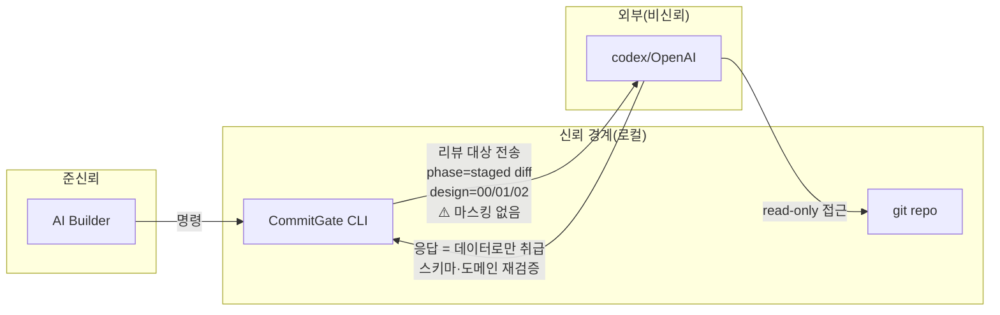

# 09. 보안·복원력

## 0. 보호 자산과 신뢰 가정

CommitGate가 직접 보호하려는 자산은 (1) 승인된 변경과 실제 커밋의 동일성, (2) 승인 증거의 무결성·anti-replay, (3) 통제점에서 사람의 최종 권한이다. 다음은 현재 신뢰 가정이다.

- Builder와 로컬 사용자는 **협조적**이며 `req:*` 계약을 따른다. 악의적 로컬 사용자의 직접 `git commit`·파일 편집을 막지 못한다.
- git 객체·인덱스는 로컬 상태의 기준이지만 git 저장소 자체가 침해되지 않았다고 가정한다.
- Codex 응답은 비신뢰 데이터로 검증하지만, Codex/OpenAI에 전달된 데이터의 보관·처리는 외부 서비스 경계다.
- 하나의 active worktree와 단일 writer를 가정한다. 분산 합의·다중 worktree 정합성은 비목표다.
- **실행 코드는 대상 repo가 아니라 `node_modules/commitgate`에 있다**(Stage B 런타임 패키지 모델). init은 관리 자산(스키마 2종·persona·config·진입점)만 배치하고 `scripts/req/**`를 **복사하지 않으며**, 대상 `package.json`에 `tsx`·`ajv`·`cross-spawn`을 **주입하지 않는다** — 이들은 CommitGate 패키지 자신의 runtime `dependencies`라 `npm i -D commitgate`가 전이 설치한다. 따라서 안전 경계(`safeSpawnSync` 등)는 대상이 선언한 버전이 아니라 **패키지가 자신의 의존성 축에서 해소한 버전**에서 돈다. 근거 [bin/init.ts](../../bin/init.ts) `planInstall`·`STAGE_B_REQ_SCRIPTS`, [scripts/smoke.mjs](../../scripts/smoke.mjs).
- 패키지 설치의 **완료**는 package manager의 책임이다. init은 `devDependencies.commitgate` **키 존재만** 확인하고(`commitgateDeclared`) 값의 형태·해소 버전·`node_modules`의 실재를 검증하지 않는다. Yarn PnP·nested workspace 정합성은 **비목표**이며 지원을 주장하지 않는다.

이 가정을 벗어난 팀 운영은 protected branch + CI verifier + 전송 정책이 필요하며, 현재는 목표 상태([14](14-product-strategy-and-roadmap.md) STR-01~03)다.

## 1. 구현된 보안 통제

| 통제 | 내용 | 근거 |
|---|---|---|
| **명령 주입 차단** | `safeSpawnSync`가 `cross-spawn`으로 **shell 없이** 실행. shell 메타문자(`;`,`&`,`|` 등)가 명령으로 해석되지 않음. Windows `.cmd` 래퍼도 안전 처리. | [scripts/req/lib/adapters.ts](../../scripts/req/lib/adapters.ts) |
| **`.cmd` 래퍼 회귀 방어** | Windows 전용 회귀 테스트가 `codex.cmd`/`npm.cmd` 경로 주입을 재현·차단(부작용 파일 미생성 + argv 리터럴 보존 검증). | [tests/unit/req-adapters-cmd.test.ts](../../tests/unit/req-adapters-cmd.test.ts) |
| **리뷰어 read-only 샌드박스** | codex는 `--sandbox read-only`(resume는 `-c sandbox_mode="read-only"`). 리뷰어가 워킹트리/인덱스를 바꾸면 **두 사후 검사**로 throw — 워킹트리는 `findUnstagedOrUntracked`(postDirty), 인덱스는 `write-tree` OID 재계산 비교(각각 별개 검출). | [scripts/req/review-codex.ts](../../scripts/req/review-codex.ts) |
| **TOML/설정 주입 차단** | `reviewModel` 슬러그 pattern, `reviewReasoningEffort` enum이 `-c model=`/`-c ...=`에 들어갈 값을 제한(조립부 이스케이프 불요). | [workflow/req.config.schema.json](../../workflow/req.config.schema.json) |
| **페르소나 심볼릭링크 이탈 차단** | `loadReviewPersona`가 realpath로 루트 이탈/심링크 탈출을 거부(비밀 파일 내용이 프롬프트로 유출되는 것 방지). 빈/부재 파일은 fail-closed. | `loadReviewPersona` |
| **프롬프트 주입 방어** | 직전 NEEDS_FIX findings를 "지시가 아닌 데이터" 블록으로 삽입, 구분자 중성화(`<<<\|>>>`→`⟪⟫`). | `buildPreviousFindingsBlock` |
| **경로 confinement(설정 축)** | `ticketRoot`/`schemaPath`/`reviewPersonaPath` 루트 내부 강제; 아카이브·manifest 경로 `..`·절대경로 거부. | config·commit·doctor |
| **설치 dest 검사(좁은 축)** | ⚠️ **repo 전역 confinement가 아니다.** `assertConfinedDest`는 호출 지점이 **`workflow/.gitignore` 한 곳**뿐이고, dest의 **상위 컴포넌트만** `lstat`으로 훑어 symlink/junction·비-디렉터리를 거부한다(preflight라 같은 `workflow/`를 쓰는 스키마 복사가 곁다리로 보호될 뿐). init의 다른 복사 경로(진입점·`AGENTS.md` 등)를 일반적으로 검사하지 않는다. | [bin/init.ts](../../bin/init.ts) `assertConfinedDest` |
| **증거 변조 탐지** | 응답 sha256을 `approvals.jsonl`·state에 고정, live 응답 sha와 대조(손편집 탐지); manifest 필드 화이트리스트(주입 차단)·중복 탐지. | `evidenceProblems`·`validateManifest` |
| **cross-spawn 하한(CVE)** | 설치 시 **대상에 이미 있던** cross-spawn이 `7.0.6` 미만이면 WARN(`--strict` 시 throw). CVE-2024-21538(ReDoS) 완화. ⚠️ Stage B에서 CommitGate는 **대상의 cross-spawn을 실행하지 않는다**(안전 경계는 패키지 자신의 `dependencies.cross-spawn`에서 돈다) → 대상에 cross-spawn이 없으면 자동 무동작이라 신규 Stage B 설치엔 영향이 없다. 이 진단의 Stage B에서의 의미는 재검토 대상(동작 불변). | [bin/init.ts](../../bin/init.ts) `crossSpawnBelowFloor` |
| **제거기 읽기 전용(구조적 고정)** | `bin/uninstall.ts`는 `node:fs` 조회 API만 쓰고 삭제 플래그(`--run`/`--force`)가 없다. Stage B 런타임 제거 안내(`npm uninstall -D commitgate`)도 **문자열 출력일 뿐 npm을 spawn하지 않는다** — 헤더가 선언만 하던 이 절이 이번에 **구조적 테스트로 고정**됐다(소스에서 `node:child_process` import와 프로세스 실행 API 문자열의 부재를 직접 검사). | [tests/unit/uninstall.test.ts](../../tests/unit/uninstall.test.ts) · [bin/uninstall.ts](../../bin/uninstall.ts) `renderRuntimeRemovalSection` |
| **BOM 방어** | `req.config.json` 및 설치기/제거기 JSON 읽기에서 UTF-8 BOM 제거(PowerShell 5 이식성). 단 `loadState`(state.json 읽기)는 `JSON.parse(readFileSync(...,'utf8'))`로 BOM을 제거하지 않는다. 쓰기 측은 BOM 없는 UTF-8로 저장(`writeState`). | `stripBom`·`writeState` |
| **비밀 전송 경고 명문화** | 리뷰가 대상을 Codex로 보낸다는 사실을 README·AGENTS가 경고로 명시하고 Builder에게 사전 확인 의무 부과. 단 그 **문구는 phase의 `git diff --cached` 전송을 중심으로 기술**하며, design 리뷰가 인덱스 00/01/02 본문을 전송하는 경로는 문서화하지 않는다(실제 동작은 본 문서 §2·[06](06-api-and-integration-contracts.md) §2 참조). | [AGENTS.template.md](../../AGENTS.template.md) §6 |

## 2. 신뢰 경계와 위협 대응

| 위협 | 대응 현황 |
|---|---|
| Builder가 승인 없이 커밋 | `req:commit` 게이트가 막음. **단, `git commit` 직접 실행은 우회 가능**(git hook 미설치) — 하드 강제 아님. |
| Builder가 통제점 자기승인 | 승인 문장 계약(사람만). 도구는 강제하지 못함(협조 전제). |
| 리뷰어 응답 위조/주입 | AJV+도메인 재검증, findings⟺승인 불변식, 프롬프트 주입 중성화. |
| 비차단 의견이 차단 채널을 점유(리뷰 비수렴) | 출력 스키마가 `findings[].severity`를 **P1만** 허용 + P1 정의 4요소를 description으로 주입([03 §4.2](03-domain-and-data-model.md)). 파생 경로 부재 시 throw=fail-closed. **완화이지 제거 아님** — 카테고리 판정은 리뷰어 재량이라 P1으로 올리는 것을 코드가 막지 못한다(`추론`). |
| staged 비밀 외부 유출 | **미방어**. 마스킹/스크러빙/길이상한 없음. Builder 사전 확인이 유일한 방어. |
| 증거 손편집 | sha256 바인딩 + live 대조로 탐지 → 게이트 FAIL. |
| 명령/경로 주입 | shell-free spawn + confinement + 슬러그/enum 제한. |
| scratch state 분실·fresh clone | 자동 재구축 없음. 커밋된 증거는 남지만 진행 상태 뷰가 복원되지 않을 수 있음. 추정 승인 금지, 사람이 증거 대조(G-09). |
| 과거 설치본의 정책 드리프트 | 설치 manifest **없음**. `commitgate migrate`가 생겼지만 그것은 Stage A→B의 **`req:*` 스크립트 값 전환 전용**이고(정확히 Stage A 주입값인 키만·기본 dry-run·쓰기 범위는 `package.json` 한 파일), 관리 자산을 갱신하지 않는다 — 자산 업그레이드/3-way merge는 범위 밖. 여전히 `--force` 또는 수동 비교가 필요하고 자동 최신 정책 적용 보장 없음(G-10). |
| Stage A/B 혼합 설치가 조용히 남음 | 두 겹으로 **가시화**한다. (1) init의 `detectStageA`(D19)가 Stage A 서명(`req:*` 값이 정확히 Stage A 주입값이거나 `scripts/req/` 존재)을 만나면 **무쓰기 실패**로 `commitgate migrate`에 보낸다 — 스크립트 주입이 기존 키를 덮지 않으므로, 막지 않으면 "런타임은 vendored인데 사용자는 Stage B라 믿는" 혼합 설치가 된다. (2) doctor D19가 `req:*` **값의 형태만**으로 설치 모드를 분류해 `mixed`를 **WARN**한다. ⚠️ **FAIL이 아니다** — `req:commit`이 doctor를 exit≠0에 throw하는 하드 게이트로 spawn하므로 FAIL이면 Stage A 형태인 이 저장소 자신을 포함해 정당한 Stage A 소비자 전원의 커밋이 **영구 차단**된다. Stage A는 결함이 아니라 legacy 설치 형태다. 근거 [bin/init.ts](../../bin/init.ts) `detectStageA` · [scripts/req/req-doctor.ts](../../scripts/req/req-doctor.ts) `classifyInstallMode`. |
| 자산↔런타임 버전 skew | **자동 감지 수단 없음 — 수용된 위험.** init의 선행 설치 확인(D14, `commitgateDeclared`)은 `devDependencies.commitgate` **키 존재만** 보고 값의 형태를 검증하지 않는다(`file:…tgz`·`link:`·`workspace:`도 정당한 설치 형태라 range로 검증하면 packed-tarball smoke가 스스로 실패한다). 이전의 `node_modules` realpath 검증은 **제거됐고**, 애초에 그 검증도 package upgrade 뒤 대상에 남은 관리 자산의 skew를 **해결하지 못했다**(실행 패키지의 동일성만 봤을 뿐). doctor D19 역시 manifest·lockfile·`node_modules`·버전을 보지 않는다. |
| 로컬 게이트 우회 후 원격 반영 | 현재 CI는 evidence를 검증하지 않아 탐지 불가. branch protection과 향후 verifier가 필요(STR-01). |

## 3. 복원력(신뢰성) 통제

| 항목 | 구현 |
|---|---|
| **fail-closed 전반** | config(ajv 스키마)·persona(존재+비공백+심링크 가드) 로드는 이상 입력에 degrade하지 않고 **throw**. `validateManifest`는 예외 대신 **문제 배열을 반환**하고 호출자가 처리한다 — live 커밋의 `evidencePreflight`는 문제가 있으면 throw(커밋 차단), dry-run은 문제를 출력하고 종료. **state 로드(`loadState`)는 최소 검증** — JSON 파싱 + `id`·`phase` 존재만 확인하고 나머지 필드는 사용 시점(`validateVerdict`·D-체크)에 방어. |
| **타임아웃** | codex 호출 **타임아웃 없음** — 미구현(0.6.0 deferred). [gaps-and-decisions.md](gaps-and-decisions.md). |
| **재시도** | 자동 재시도 없음. `invalid`는 `req:next` G2가 1회 RUN 재시도 허용, blocked는 회로차단(2회). |
| **중복 처리(멱등)** | evidence-finalize `manifestHasConsumed` 중복 skip; 재리뷰 안전(라운드 증가). |
| **트랜잭션 경계** | 커밋은 순서 보장: 소스 커밋 → 마커 → evidence-finalize → consume. 중단 시 `--finalize`로 복구. |
| **anti-replay** | `consumed_approvals`가 한 승인 트리를 한 커밋만 소비하게 함. |
| **장애 격리** | 각 명령이 독립 단명 프로세스. 공유 장기 상태 없음. |
| **버퍼 한도** | git/codex maxBuffer 64 MiB(초과 시 실패). |

## 4. 미구현 보안·복원력 항목(명시적 분리)
[docs/follow-ups-design.md](../../docs/follow-ups-design.md)·CHANGELOG 0.5.0/0.6.0 기준. 재구현 시 "구현됨"으로 오해하지 말 것.

- **codex 호출 타임아웃 없음** — 응답 지연/무한 대기 방어 미구현(Windows `cmd.exe` 프로세스 트리 kill 난이도로 deferred).
- **secret-safe 실패 진단 없음** — 실패 시 stderr에 비밀이 섞일 가능성 완전 차단 미구현(deferred).
- **리뷰 전 secret-scan 훅 없음**(`preReviewCommand` 미구현) — staged diff 자동 스캔 없음.
- **git hook 미설치** — 하드 강제 아님. `git commit` 직접 실행이 게이트를 우회.
- **`trunkBranch` 하드코딩** `'main'` — 설정화 미구현.
- **상태 자동 재구축 없음** — `state.json` scratch 변경이 사라지면 커밋된 증거에서 실행 상태를 복원하는 명령이 없음.
- **설치 정책 버전 원장 없음** — 대상 repo가 어느 CommitGate 계약을 쓰는지 기계적으로 증명·업그레이드하기 어려움. Stage B에서도 **자산↔런타임 skew 자동 감지 수단이 없다**: D14는 `devDependencies.commitgate` 키 존재만 확인하고, `node_modules` realpath 검증은 **제거됐다**(그 검증도 upgrade 후 자산 skew를 풀지 못했다). doctor D19는 `req:*` 값의 형태만 본다. 자산 업그레이드·3-way merge·lockfile/manifest 파서·Yarn PnP·nested workspace는 **범위 밖**이다.
- **CI evidence verifier 없음** — 로컬 게이트 우회를 원격 protected branch에서 검증하지 않음.

## 5. 감사 로그
- 승인 증거는 `responses/approvals.jsonl`(append-only) + `responses/<...>.json` 아카이브에 영구 보존.
- 삭제 경로 없음(제거 시에도 증거 보호). 상세 [03-domain-and-data-model.md](03-domain-and-data-model.md) §5.
- 별도 보안 이벤트 로깅/SIEM 연동 없음(`해당 없음`).
