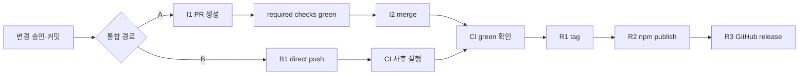

# 10. 운영·배포·관측성

## 1. 환경

CommitGate는 배포되는 서비스가 아니라 **npm 패키지**다. "환경"은 (1) 개발/CI, (2) 대상 사용자 repo(설치처), (3) npm 레지스트리(배포처)로 나뉜다. staging/prod 같은 런타임 환경은 없다(`해당 없음`).

## 2. CI 파이프라인([.github/workflows/ci.yml](../../.github/workflows/ci.yml))

| 항목 | 값 |
|---|---|
| 워크플로명 | `CI` |
| 트리거 | `push`(branches: `main`, tags: `v*`), `pull_request`(전체) |
| Job | `build` (`${{matrix.os}} · node ${{matrix.node}}`) |
| 매트릭스 | `os: [ubuntu-latest, macos-latest, windows-latest]` × `node: [18,20,22]` = **9-leg** (`fail-fast: false`) |
| 스텝 | `checkout@v4` → `setup-node@v4(cache:npm)` → `npm ci` → `npm run typecheck` → `npm test` → `npm run smoke` |

- Windows 러너가 `.cmd` 경로도 검증(smoke 주석).
- **CI에서 실행하지 않는 것**: `req:review-codex`/`req:commit`(라이브 codex + 인증 필요). 리뷰 **로직**은 `createFakeReviewerAdapter` 단위 테스트가 전 OS에서 커버.
- 릴리즈 자동화는 워크플로에 없음 — publish/tag/release는 수동 통제점(§4).

## 3. 스모크·검증 스크립트

### `scripts/smoke.mjs` — pack tarball 설치 스모크
1. `npm pack` → `.tgz` 생성.
2. 임시 타깃 repo(`git init` + 헤르메틱 빈 `core.excludesFile`/`.git/info/exclude` + `package.json`).
3. `npm install -D <tgz>`(deps/bin/`files` 화이트리스트 검증).
4. `npx --no-install commitgate --dry-run`(rc=0) → 실제 `npx commitgate` → `workflow/.gitignore` 생성 확인 → `codex-response.json` 생성 후 `git check-ignore` 확인(REQ-2026-012).
5. `npx --no-install commitgate uninstall`(rc=0, uninstall.ts 로드 확인).
6. `finally`: 임시 디렉터리 정리. 실패 시 `smoke 실패: … (exit=…)`.

### `scripts/verify-review-overrides.mjs` — 모델/추론강도 override 실효성(수동)
- 라이브 codex + 인증 필요(CI 게이트 아님). arg-capture 단위 테스트는 `-c` 전달만 증명하므로, **bogus 값을 넣어 codex가 거부하는지**로 override가 실제 도달했음을 검증.
- bogus 모델 → `not supported`/`not found`; bogus effort → `[reasoning.effort] [invalid_enum_value]`. exec·resume 두 경로 모두 검사(4/4 pass → exit 0). 상수 `VALID_MODEL='gpt-5.6-terra'`, `VALID_EFFORT='high'`.

## 4. 릴리즈 통제점([docs/RELEASING.md](../../docs/RELEASING.md))

각 통제점은 고유 승인 문장을 가지며 이월되지 않는다(전체 표는 [04-user-roles-and-permissions.md](04-user-roles-and-permissions.md) §4).

- **배포 게이트**: 전 플랫폼 CI green이 `npm publish`·PR merge(`I2`)의 선행조건. CI = 9-leg(`npm ci → typecheck → test → smoke`).
- **통합 경로**: A(PR 경유, 1인 개발이면 선택) / B(direct push). 경로 B는 (1) bypass가 일어났다는 사실, (2) CI가 **사후**(`on: push`)라는 점, (3) 승인 문장 정확성을 반드시 공개.
- **버전 범프 필수**: `npm version <patch|minor|major> --no-git-tag-version`. `package.json` + `package-lock.json`의 두 위치가 일치해야 함.
- **릴리즈 대상 커밋 확정**: `HEAD == origin/main` + CI green 확인 후에만 R1/R2/R3.
- 로컬 자체검사(`typecheck && test && smoke`)는 9-leg 매트릭스를 **대체하지 않는다**.
- **R2(npm publish)**: 2FA·사람 최종 확인, 완전 자동화 없음.

## 5. 관측성

- **텔레메트리/메트릭/트레이싱 없음**(`해당 없음`). 외부 관측 백엔드 연동 없음.
- **주 신호 = exit code**(fail-closed):
  - `req:review-codex`: approved 0 / invalid 1 / blocked 2 / needs-fix 3.
  - `req:next`: RUN 0 / AGENT 0 / BLOCKED 2 / AWAIT_HUMAN 10 / DONE 11.
  - `req:doctor`: 0 pass / 1 FAIL.
  - `req:new`/`req:commit`: 0 성공 / throw로 비-0.
- **로그**: 사람이 읽는 진단은 `console.error`(findings·next_action·observations·blocked 안내). `req:next --json`은 구조화 JSON. **설치기 bin(`bin/init.ts`·`bin/uninstall.ts`)의 `runCli`**만 예외를 한 줄 메시지 + exit 1로 변환(스택트레이스 숨김)한다. **`scripts/req/*.ts`에는 `runCli`이 없고**, top-level 예외를 자체 변환하지 않아 미처리 예외가 node 기본 방식(스택트레이스 + 비-0 exit)으로 표면화된다.
- **운영자가 볼 신호**: 명령 exit code + stderr 텍스트가 전부. 자동 알림 없음.

### 5.1 측정할 수 없는 현재 제품 성과

현재 로그·원장만으로 개별 티켓의 승인/소비 사실은 확인할 수 있지만 다음 운영 지표를 자동 집계하는 명령은 없다.

- 설치부터 첫 승인 커밋까지 걸린 시간
- 설계/phase별 리뷰 라운드 P50/P95와 escalation 비율
- Codex 대기 시간·timeout·usage limit 분포
- stale·증거 불일치·P1·BLOCKED의 발생 빈도
- fresh clone 상태 재구축 성공률
- protected branch 커밋의 증거 검증률

따라서 테스트 통과 수나 아카이브 개수를 사용자 가치의 대리 지표로 과대 해석하지 않는다. 목표 지표는 [14-product-strategy-and-roadmap.md](14-product-strategy-and-roadmap.md) §4, 코드 내용을 수집하지 않는 로컬 리포트 설계는 STR-08에 정의한다.

## 6. 운영 명령·백업·복구
- **백업**: 별도 백업 시스템 없음 — 증거는 git 히스토리에 있으므로 git 백업이 곧 증거 백업.
- **복구**: evidence-finalize 중단은 `req:commit --finalize`(고아 소스 커밋 복구 포함). 제거 되돌리기는 git이 정본(`git revert`/`git checkout HEAD --`, [bin/uninstall.ts](../../bin/uninstall.ts)가 계획 출력).
- **롤백/데이터 마이그레이션**: 서비스 배포가 없어 런타임 롤백은 `해당 없음`. 패키지 롤백은 이전 버전 재-publish(npm 정책 의존).

## 7. 운영 성숙도 판단

| 축 | 현재 수준 | 다음 종료 조건 |
|---|---|---|
| 로컬 정확성 | 높음 — tree/증거/anti-replay 검사 | 유지 |
| 원격 강제 | 낮음 — CI가 evidence 미검증 | `commitgate verify` required check |
| 장애 복구 | 중간 — evidence-finalize 복구, 전체 state rebuild 없음 | fresh clone rebuild 100% |
| 진단 | 낮음 — 텍스트/스택 중심, timeout 없음 | 안정적 오류 코드 + 전 명령 JSON |
| 업그레이드 | 낮음 — vendored 파일 원장 없음 | plan/manifest/rollback |
| 제품 분석 | 낮음 — 집계 없음 | privacy-preserving `req:report` |

운영 우선순위는 [14](14-product-strategy-and-roadmap.md)의 P0(원격 신뢰·상태 복구·전송 안전·수렴) 이후 P1(진단·업그레이드·리포트) 순서를 따른다.
