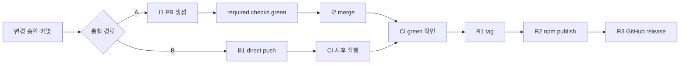

# 10. 운영·배포·관측성

## 1. 환경

CommitGate는 배포되는 서비스가 아니라 **npm 패키지**다. "환경"은 (1) 개발/CI, (2) 대상 사용자 repo(설치처), (3) npm 레지스트리(배포처)로 나뉜다. staging/prod 같은 런타임 환경은 없다(`해당 없음`).

## 2. CI 파이프라인([.github/workflows/ci.yml](../../.github/workflows/ci.yml))

| 항목 | 값 |
|---|---|
| 워크플로명 | `CI` |
| 트리거 | `push`(branches: `main`, tags: `v*`), `pull_request`(전체) |
| Job | `build` (`${{matrix.os}} · node ${{matrix.node}}`) |
| 매트릭스 | `os: [ubuntu-latest, macos-latest, windows-latest]` × `node: [18,20,22]` = **9-leg** (`fail-fast: false`) |
| 스텝 | `checkout@v4` → `setup-node@v4(cache:npm)` → `npm ci` → `npm run typecheck` → `npm test` → `npm run smoke` |

- Windows 러너가 `.cmd` 경로도 검증(smoke 주석).
- **CI에서 실행하지 않는 것**: `req:review-codex`/`req:commit`(라이브 codex + 인증 필요). 리뷰 **로직**은 `createFakeReviewerAdapter` 단위 테스트가 전 OS에서 커버.
- 릴리즈 자동화는 워크플로에 없음 — publish/tag/release는 수동 통제점(§4).
- 🔴 **트리거가 곧 게이트 한계다.** `on:`은 `push`(`main`·`v*` 태그)·`pull_request`뿐이다. PR을 경유하지 않고 `main`에 direct push하면 CI는 **push 이후에** 돈다 — 반영을 사전에 막지 못한다. 실측 사례: **Stage B(REQ-2026-014)는 branch protection bypass direct push로 `main`에 들어간 뒤 CI가 실행됐다.** 보고된 **9/9 success(3 OS × Node 18/20/22)는 사실이지만, 이 사례에서 병합을 사전에 막는 게이트가 아니었다.** [04](04-user-roles-and-permissions.md) §4 `B1`의 "경로 B에서 CI는 사후 검증"과 같은 축이며, 그 서술을 약화하지 않는다.

## 3. 스모크·검증 스크립트

### `scripts/smoke.mjs` — pack tarball 설치 스모크

로컬 소스가 아니라 **`npm pack` tarball을 임시 repo에 설치해 그 bin을 실행**한다 → 실제 배포 아티팩트(`bin` 해소·`files` 화이트리스트·deps 설치)를 검증한다. 일회용 `npm_config_cache`(임시 디렉터리)로 격리하므로 **개발자의 실제 npm 캐시를 건드리지 않는다**.

1. `npm pack` → `.tgz` 생성.
2. 임시 타깃 repo(`git init` + 헤르메틱 빈 `core.excludesFile`/`.git/info/exclude` + `package.json`).
3. `npm install -D <tgz>`(deps/bin/`files` 화이트리스트 검증).
4. `npx --no-install commitgate --dry-run`(rc=0) → 실제 `npx commitgate` → `workflow/.gitignore` 생성 확인 → `codex-response.json` 생성 후 `git check-ignore` 확인(REQ-2026-012).
5. **Stage B 인수 기준**(REQ-2026-014 — packed 설치본에서만 드러난다):
   - **무복사**: 대상에 `scripts/req/`가 없어야 한다(실행 코드는 `node_modules/commitgate`에만).
   - **무주입**: 대상 `dependencies`/`devDependencies` 어디에도 `tsx`·`ajv`·`cross-spawn`이 없어야 한다. 반면 사용자가 넣은 `devDependencies.commitgate` 선언은 **살아 있어야** 한다(init의 D14 전제).
   - **`req:*` 형태**: 다섯 키가 정확히 `commitgate <verb>`. 검증 목록을 하드코딩하지 않고 [bin/dispatch.mjs](../../bin/dispatch.mjs) `VERB_MODULES`에서 파생해 SSOT를 하나로 유지한다(verb 누락 시 smoke가 잡는다).
   - **dispatch 도달 증명**: `npm run req:doctor`가 **rc≠0 + req-doctor 자신의 사용법 오류**(`REQ id 또는 --ticket`)를 내는지 본다. ⚠️ 이것은 "doctor가 통과한다"는 증명이 **아니다** — fresh·티켓 없는 대상에서 rc=0으로 끝나는 `req:*` verb는 하나도 없다. `npm script → node_modules/.bin/commitgate 해소 → 런처의 tsx 등록 → dispatch가 **패키지 안의** req-doctor.ts로 라우팅 → 그 모듈의 parseArgs 실행`이라는 사슬의 **도달**을 증명한다. 판별력의 근거는 실패 메시지가 서로 다르다는 것이다(미등록 verb면 런처의 "알 수 없는 명령", bin 해소 실패면 npm의 "not found").
6. `npx --no-install commitgate uninstall`(rc=0) — **읽기 전용 검증**: 실행 전후 대상 tree 스냅샷이 동일해야 한다.
7. `migrate` 비파괴(별도 Stage A 시드 대상 — fresh 대상에 겹쳐 쓰면 init의 D19가 발동해 다른 것을 검증하게 된다): dry-run이 부작용 0건, `--apply`가 **정확한 Stage A 값만** 전환하고 사용자 정의 `req:doctor`·무관 스크립트·vendored `scripts/req/req-new.ts`를 **보존**하는지 확인.
8. `finally`: 임시 디렉터리(pack·target·npm 캐시) 정리. 실패 시 `smoke 실패: … (exit=…)`.

⚠️ **스냅샷은 파일 크기만 비교한다**(경로 → size). 크기가 같은 내용 변경은 놓칠 수 있다 — 읽기 전용 위반의 완전한 증명이 아니다.

### `scripts/verify-review-overrides.mjs` — 모델/추론강도 override 실효성(수동)
- 라이브 codex + 인증 필요(CI 게이트 아님). arg-capture 단위 테스트는 `-c` 전달만 증명하므로, **bogus 값을 넣어 codex가 거부하는지**로 override가 실제 도달했음을 검증.
- bogus 모델 → `not supported`/`not found`; bogus effort → `[reasoning.effort] [invalid_enum_value]`. exec·resume 두 경로 모두 검사(4/4 pass → exit 0). 상수 `VALID_MODEL='gpt-5.6-terra'`, `VALID_EFFORT='high'`.

## 4. 릴리즈 통제점([docs/RELEASING.md](../../docs/RELEASING.md))

각 통제점은 고유 승인 문장을 가지며 이월되지 않는다(전체 표는 [04-user-roles-and-permissions.md](04-user-roles-and-permissions.md) §4).

- **배포 게이트**: 전 플랫폼 CI green이 `npm publish`·PR merge(`I2`)의 선행조건. CI = 9-leg(`npm ci → typecheck → test → smoke`).
- **통합 경로**: A(PR 경유, 1인 개발이면 선택) / B(direct push). 경로 B는 (1) bypass가 일어났다는 사실, (2) CI가 **사후**(`on: push`)라는 점, (3) 승인 문장 정확성을 반드시 공개.
- **버전 범프 필수**: `npm version <patch|minor|major> --no-git-tag-version`. `package.json` + `package-lock.json`의 두 위치가 일치해야 함.
- **릴리즈 대상 커밋 확정**: `HEAD == origin/main` + CI green 확인 후에만 R1/R2/R3.
- 로컬 자체검사(`typecheck && test && smoke`)는 9-leg 매트릭스를 **대체하지 않는다**.
- **R2(npm publish)**: 2FA·사람 최종 확인, 완전 자동화 없음.

## 5. 관측성

- **텔레메트리/메트릭/트레이싱 없음**(`해당 없음`). 외부 관측 백엔드 연동 없음.
- **주 신호 = exit code**(fail-closed):
  - `req:review-codex`: approved 0 / invalid 1 / blocked 2 / needs-fix 3.
  - `req:next`: RUN 0 / AGENT 0 / BLOCKED 2 / AWAIT_HUMAN 10 / DONE 11.
  - `req:doctor`: 0 pass / 1 FAIL.
  - `req:new`/`req:commit`: 0 성공 / throw로 비-0.
- **로그**: 사람이 읽는 진단은 `console.error`(findings·next_action·observations·blocked 안내). `req:next --json`은 구조화 JSON.
- **예외 표면화는 진입 경로에 따라 갈린다**(REQ-2026-014 Phase 1, `95d94b8`). 설치기 bin(`bin/init.ts`·`bin/uninstall.ts`)에 더해 **`scripts/req/*.ts` 다섯 개 전부가 `runCli(argv)`를 export한다** — `main(argv)`를 try/catch로 감싸 예외를 `commitgate: <메시지>` 한 줄 + `process.exitCode = 1`로 변환하고 스택트레이스를 숨긴다(근거 [scripts/req/req-new.ts](../../scripts/req/req-new.ts) `runCli`, 나머지 넷도 동일 형태). 다만 `runCli`의 **존재가 두 경로를 통일하지는 않는다**:
  - **dispatch 경유**(`npm run req:*` → `commitgate <verb>` → [bin/commitgate.mjs](../../bin/commitgate.mjs)): 런처가 verb를 해소해 모듈을 동적 import한 뒤 **`mod.runCli(rest)`를 호출**하므로 이 경계가 적용된다 → 한 줄 오류 + exit 1. import 경로라 대상 모듈의 `if (isMain)` 가드는 발화하지 않아 중복 실행도 없다.
  - **직접 `tsx scripts/req/<x>.ts` 실행**(Stage A legacy·CommitGate 저장소 자신): 각 모듈의 마지막 줄이 `if (isMain) main()`이라 **`runCli`이 아니라 `main()`을 그대로 호출**한다 → 경계를 타지 않고 미처리 예외가 node 기본 방식(스택트레이스 + 비-0 exit)으로 표면화된다. **종전 동작 그대로**이며 하위호환을 위해 의도된 것이다.
  - 따라서 같은 오류라도 **dispatch면 한 줄, 직접 실행이면 스택트레이스**다. 운영자가 보는 진단 형태가 설치 모드에 따라 달라진다.
- **운영자가 볼 신호**: 명령 exit code + stderr 텍스트가 전부. 자동 알림 없음.

### 5.1 측정할 수 없는 현재 제품 성과

현재 로그·원장만으로 개별 티켓의 승인/소비 사실은 확인할 수 있지만 다음 운영 지표를 자동 집계하는 명령은 없다.

- 설치부터 첫 승인 커밋까지 걸린 시간
- 설계/phase별 리뷰 라운드 P50/P95와 escalation 비율
- Codex 대기 시간·timeout·usage limit 분포
- stale·증거 불일치·P1·BLOCKED의 발생 빈도
- fresh clone 상태 재구축 성공률
- protected branch 커밋의 증거 검증률

따라서 테스트 통과 수나 아카이브 개수를 사용자 가치의 대리 지표로 과대 해석하지 않는다. 목표 지표는 [14-product-strategy-and-roadmap.md](14-product-strategy-and-roadmap.md) §4, 코드 내용을 수집하지 않는 로컬 리포트 설계는 STR-08에 정의한다.

## 6. 운영 명령·백업·복구
- **백업**: 별도 백업 시스템 없음 — 증거는 git 히스토리에 있으므로 git 백업이 곧 증거 백업.
- **복구**: evidence-finalize 중단은 `req:commit --finalize`(고아 소스 커밋 복구 포함). 제거 되돌리기는 git이 정본(`git revert`/`git checkout HEAD --`, [bin/uninstall.ts](../../bin/uninstall.ts)가 계획 출력).
- **롤백/데이터 마이그레이션**: 서비스 배포가 없어 런타임 롤백은 `해당 없음`. 패키지 롤백은 이전 버전 재-publish(npm 정책 의존).

## 7. 운영 성숙도 판단

| 축 | 현재 수준 | 다음 종료 조건 |
|---|---|---|
| 로컬 정확성 | 높음 — tree/증거/anti-replay 검사 | 유지 |
| 원격 강제 | 낮음 — CI가 evidence 미검증 | `commitgate verify` required check |
| 장애 복구 | 중간 — evidence-finalize 복구, 전체 state rebuild 없음 | fresh clone rebuild 100% |
| 진단 | 낮음 — 텍스트/스택 중심, timeout 없음 | 안정적 오류 코드 + 전 명령 JSON |
| 업그레이드 | 낮음 — Stage B에서 **런타임**은 `npm i -D commitgate`로 갱신되지만, 대상에 남는 **관리 자산**(스키마·persona·진입점)의 원장이 없어 **자산↔런타임 skew를 감지할 수단이 없다**. `commitgate migrate`는 Stage A→B의 `req:*` 값 전환 전용이지 업그레이드 도구가 아니다 | 자산 원장 + skew 감지 + 안전 upgrade — **후속 과제(미구현)** |
| 제품 분석 | 낮음 — 집계 없음 | privacy-preserving `req:report` |

운영 우선순위는 [14](14-product-strategy-and-roadmap.md)의 P0(원격 신뢰·상태 복구·전송 안전·수렴) 이후 P1(진단·업그레이드·리포트) 순서를 따른다.
